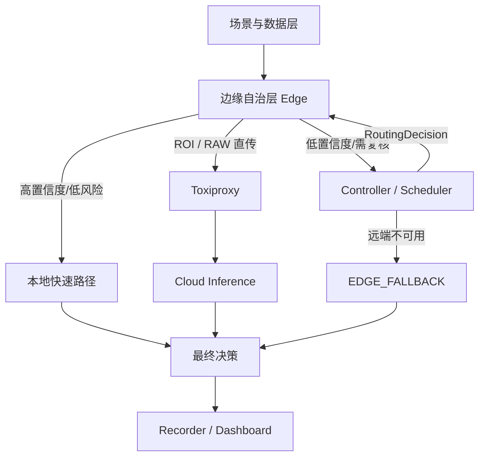

# Cloud-Edge Decision System

面向 XH-202606 赛题的云边协同感知与决策原型。默认 MVP 采用 **Edge–Controller–Cloud** 架构，验证四条核心路径：

- `EDGE`：高置信度、低风险任务由边缘端直接处理；
- `CLOUD`：低置信度任务在网络可用时交给云端增强推理；
- `EDGE_FALLBACK`：云端不可用或超时时，执行本地保守降级；
- `EDGE_SAFETY`：高风险任务在边缘端立即执行安全动作，不等待远端。

> 当前版本：MVP v0.3（范围对齐）。主场景冻结为金属工业零部件表面缺陷检测，代码已提供
> YOLO + EfficientAD ONNX 组合 Adapter、五类缺陷契约和可选 Cloud VLM 结构化复核；仓库不携带
> 模型权重或真实数据。默认 Compose 是软件模拟，Peer Edge 仅保留为可选扩展。



## 1. 服务组成

| 服务 | 本地端口 | 职责 |
|---|---:|---|
| Edge | 8001 | 图像/遥测推理、质量门控、YOLO+EfficientAD Adapter、ROI、软件终态与 outbox |
| Controller | 8002 | Edge–Cloud 选路、deadline、网络与回退控制 |
| Cloud Node | 8003 | 软件模拟或受约束的视觉大模型复核 Adapter |
| Recorder | 8004 | SQLite 事件日志和指标汇总 |
| Toxiproxy | 8474 / 8666 | 模拟云端链路时延、限速、TCP 连接故障和断网 |
| Dashboard | 8080 | 展示最近决策与路由统计 |

## 2. 快速启动

前置条件：Docker Desktop 或 Docker Engine，支持 `docker compose`。

```bash
cp .env.example .env
docker compose up --build -d
```

检查服务：

```bash
curl http://localhost:8001/health
curl http://localhost:8002/health
curl http://localhost:8003/health
curl http://localhost:8004/health
```

运行四条 MVP 主路径的冒烟测试：

```bash
docker compose -f docker-compose.yml -f compose.test.yml up --build -d
python scripts/smoke_test.py
```

Peer Edge 只在后期扩展验证时显式叠加：

```bash
docker compose -f docker-compose.yml -f compose.peer.yml up --build -d
```

默认 Compose 配置会关闭 `ALLOW_TEST_CONTROLS`，因此请求中的 `metadata.force_confidence`
不会影响调度。冒烟测试使用 `compose.test.yml` 显式开启该测试专用控制；不要在共享或生产环境启用它。

Controller 始终按 `TRUSTED_NODE_ENDPOINTS` 校验节点 ID 与服务地址。共享或非本机部署还应为 `NODE_REGISTRATION_TOKEN` 设置随机值；Compose
会把同一令牌注入 Controller、Edge 和 Cloud，令牌为空只适合隔离的本机演示环境。

打开 Dashboard：

```text
http://localhost:8080
```

停止：

```bash
docker compose down
```

## 3. 手动请求

```bash
curl -X POST http://localhost:8001/v1/tasks \
  -H 'Content-Type: application/json' \
  -d '{
    "task_id": "demo-001",
    "scene": "industrial",
    "payload": {
      "temperature": 84,
      "vibration": 7.2,
      "current": 16.2,
      "log": "轴承出现间歇异响"
    },
    "risk_level": "high",
    "deadline_ms": 900,
    "metadata": {"force_confidence": 0.55}
  }'
```

默认配置会忽略 `metadata.force_confidence`。如需复现该测试路由，请先用上方的
`compose.test.yml` 覆盖启动；测试控制已应用时会写入 Edge 日志和 Recorder 决策事件的
`edge_result.reason`。

提交本地图像（PNG/JPEG/BMP）并自动计算尺寸、SHA-256 与 Base64：

```bash
python scripts/submit_vision_task.py \
  --image path/to/image.png \
  --edge-url http://localhost:8001 \
  --workpiece-id demo-part-001 \
  --workpiece-type machined-metal-bracket \
  --station-id camera-a
```

该命令不会把本地文件路径或文件名写入任务或 Controller。默认软件模拟 Adapter 用于验证图像解码、
质量、bbox、ROI 和云边调度，不应把它的输出写成真实工业模型准确率。MVP profile 当前固定为
`machined-metal-bracket`、材质 `metal`，缺陷标签为划痕、裂纹、凹坑/磨损、污染、缺件/装配异常。

### 真实视觉模型模式

真实 Edge 模式需要团队提供两个经过验证的 ONNX 文件：带端到端 NMS 的 YOLO 输出
`[x1,y1,x2,y2,score,class_id]`，以及输出 `anomaly_score` 和 `anomaly_map` 的 EfficientAD。

```bash
python -m pip install -r requirements.txt
EDGE_VISION_BACKEND=yolo_efficientad
INDUSTRIAL_VISION_PROFILE=/app/configs/industrial-vision-profile.json
YOLO_ONNX_PATH=/app/models/artifacts/yolo-defects-nms.onnx
EFFICIENTAD_ONNX_PATH=/app/models/artifacts/efficientad.onnx
```

Cloud VLM 模式使用 OpenAI-compatible `/chat/completions` 接口，只接受固定 JSON 缺陷结构；模型建议的
自由动作不会直接执行。启用时必须同时配置 `CLOUD_VLM_ENDPOINT`、`CLOUD_VLM_MODEL` 和
`CLOUD_VLM_API_KEY`，并显式设置 `CLOUD_VLM_DATA_EXPORT_APPROVED=true`；缺项或未批准图像外传会拒绝启动。

## 4. 模拟云端断开

```bash
curl -X POST http://localhost:8474/proxies/cloud \
  -H 'Content-Type: application/json' \
  -d '{"enabled": false}'
```

默认 MVP 不启用 Peer Edge，因此关闭 Cloud 后低置信度任务必须进入 `EDGE_FALLBACK`。冒烟脚本
先确认 Toxiproxy 已关闭 Cloud，再断言回退因果。恢复云端：

```bash
curl -X POST http://localhost:8474/proxies/cloud \
  -H 'Content-Type: application/json' \
  -d '{"enabled": true}'
```

## 5. 本地开发与测试

```bash
python -m pip install -r requirements-dev.txt
PYTHONPATH=src pytest -q
ruff check src tests scripts
```

容器不可用时，可以分别启动各 FastAPI 服务；具体命令见 [本地测试方案](docs/TEST_PLAN.md)。

## 6. 边缘大模型压缩扩展（非主线）

真实模型阶段使用 scripts/benchmark_edge_llm.py 记录模型文件大小、进程内存峰值、显存、TTFT 和生成速度。模型权重必须存放在 models/artifacts/，该目录已被 Git 忽略。

以量化 DeepSeek-R1-Distill-Qwen-1.5B 为例：

    python scripts/benchmark_edge_llm.py \
      --model models/artifacts/deepseek-r1-distill-qwen-1.5b-q4_0/deepseek-r1-distill-qwen-1.5b-q4_0.gguf \
      --context 512 \
      --gpu-layers -1 \
      --output experiments/results/edge-llm-q4.json

此脚本只记录可复现实测值；赛题的 1.5GB 内存、TTFT 和能力保持率须与全量云端模型及相同评测集进行对照后才可声明达标。

在 RTX 5070 Laptop GPU（8GB）、DeepSeek-R1-Distill-Qwen-1.5B Q4_0 GGUF 的当前开发机上，一次预热测量得到：65-token 输入、32-token 输出的模型生成总耗时 174.45ms、TTFT 6.99ms、吞吐 183.43 tok/s；CPU 对照为 16.0s TTFT、1.55 tok/s。首次 CUDA 内核初始化约 34.6s，因此服务化时需要在就绪前预热。注意：当前 Adapter 集成测量仍约 17.1 秒，说明该微基准不能外推为端到端服务指标；正式实时链路保持 `rule` 后端，需完成性能定位后才可启用 LLM。脱敏的单次原始 JSON 与采集限制见 `experiments/results/`。

边缘节点支持可选 GGUF Adapter，默认仍是稳定且无需模型运行时的 `rule` 后端。启用实际模型时配置：

```bash
EDGE_INFERENCE_BACKEND=llm
EDGE_LLM_MODEL_PATH=/absolute/path/to/model.gguf
EDGE_LLM_GPU_LAYERS=-1
EDGE_LLM_WARM_ON_START=true
```

LLM 只可细化非紧急任务；规则检测到工业 `critical` 或交通 `incident` 时，仍直接执行本地安全动作。为避免受约束自由文本造成的延迟，模型仅输出受限风险标签，系统再做确定性动作映射；模型结果的 confidence 会与规则 confidence 取较小值。该后端当前仅用于离线验证，默认 Docker 镜像不携带模型权重或 CUDA 运行时，正式 GPU 部署需使用带相应运行时的镜像并挂载模型目录。

## 7. 文档入口

当前实现与提交状态：

- [DREAM-CE 创新算法与实现边界](docs/DREAM_CE_ALGORITHM.md)
- [最终方案范围对齐与实施计划](docs/SCOPE_ALIGNMENT_PLAN.md)
- [工业视觉技术实现方案](docs/INDUSTRIAL_VISION_TECHNICAL_IMPLEMENTATION.md)
- [系统架构摘要](docs/ARCHITECTURE.md)
- [API 设计](docs/API.md)
- [本地、冒烟与压力测试方案](docs/TEST_PLAN.md)
- [模型单次基准与限制](docs/MODEL_BENCHMARK.md)
- [2026-08-31 P0 提交状态与证据清单](docs/SUBMISSION_STATUS_2026-08-30.md)
- [压力测试、指标口径与待确认问题](docs/STRESS_TEST_AND_METRICS_REVIEW.md)
- [算法与模型设计](docs/ALGORITHM_AND_MODEL_DESIGN.md)
- [算法与模型设计阶段报告](docs/ALGORITHM_AND_MODEL_DESIGN_STAGE_REPORT.md)

研究设计与后续实现规格：

- [云边调度模块调研与设计](docs/CLOUD_EDGE_SCHEDULING_MODULE.md)
- [调度器技术规格](docs/SCHEDULER_TECHNICAL_SPEC.md)
- [完整系统设计](docs/SYSTEM_DESIGN.md)
- [Roadmap](docs/ROADMAP.md)
- [阶段状态记录](docs/WEEKLY_STATUS.md)
- [仓库结构规范](docs/REPOSITORY_STRUCTURE.md)
- [架构决策记录](docs/decisions/)

## 8. 当前边界

当前已提供 Edge–Controller–Cloud 软件主链、视觉与遥测统一契约、五类缺陷 profile、
YOLO+EfficientAD ONNX Adapter、可选 Cloud VLM 结构化复核、交通视觉迁移探针、ROI/RAW 直传、
SQLite 动作幂等/outbox、deadline 回退和指标脚本。仍待团队补充有许可工业/交通数据、真实模型
权重及冻结环境下的正式实验。文档中的比赛阈值均为目标；除非 `docs/evidence/` 有对应环境、
commit 和原始输出，否则不代表已经达标。Toxiproxy 的随机 TCP 连接重置不能表述为包级丢包；
精确丢包证据需使用 Linux `tc netem`。

P0 的“幂等”主要指单 worker 下 SQLite 保存的软件最终决策和补传记录；Cloud 仅有进程内的
有限去重缓存，重启或缓存淘汰后可能再次计算。仓库没有连接 PLC，也不宣称分布式现场动作
exactly-once。Peer Edge 与 DREAM-Fuse 代码只在叠加 `compose.peer.yml` 时作为后期扩展启用，
不属于默认 MVP。弱网 runner 使用隔离的
Controller-to-Cloud 合成 workload 验证代理故障、回退与恢复门禁，不等同于完整 Edge 图像端到端
性能或正式比赛指标实验。
