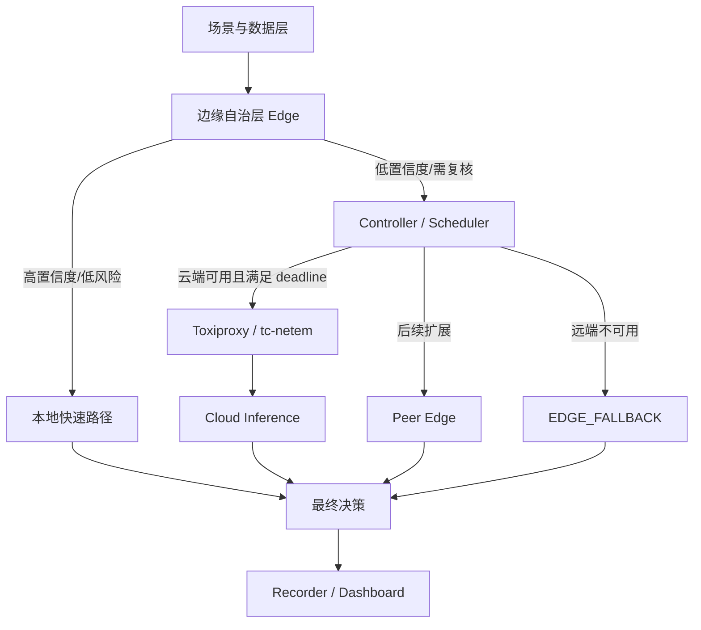

# Cloud-Edge Decision System

面向 XH-202606 赛题的云边协同感知与决策原型。项目采用 **边缘自治 + 中央协同调度 + 云端增强** 架构，首先验证四条核心路径：

- `EDGE`：高置信度、低风险任务由边缘端直接处理；
- `CLOUD`：低置信度任务在网络可用时交给云端增强推理；
- `EDGE_FALLBACK`：云端不可用或超时时，执行本地保守降级；
- `EDGE_SAFETY`：高风险任务在边缘端立即执行安全动作，不等待远端。

> 当前版本：MVP v0.1。默认使用可解释规则模型，用于验证系统架构、调度路径、弱网降级和指标采集。真实 ONNX/轻量模型将在不改变服务接口的前提下替换。



## 1. 服务组成

| 服务 | 本地端口 | 职责 |
|---|---:|---|
| Edge A | 8001 | 本地推理、置信度判断、安全动作 |
| Controller | 8002 | 云端调用、超时控制、本地降级 |
| Cloud Node | 8003 | 较强的融合推理服务 |
| Recorder | 8004 | SQLite 事件日志和指标汇总 |
| Toxiproxy | 8474 / 8666 | 模拟云端链路延迟、丢包和断网 |
| Dashboard | 8080 | 展示最近决策与路由统计 |

## 2. 快速启动

前置条件：Docker Desktop 或 Docker Engine，支持 `docker compose`。

```bash
cp .env.example .env
docker compose up --build -d
```

检查服务：

```bash
curl http://localhost:8001/health
curl http://localhost:8002/health
curl http://localhost:8003/health
curl http://localhost:8004/health
```

运行四条主路径的冒烟测试：

```bash
python scripts/smoke_test.py
```

打开 Dashboard：

```text
http://localhost:8080
```

停止：

```bash
docker compose down
```

## 3. 手动请求

```bash
curl -X POST http://localhost:8001/v1/tasks \
  -H 'Content-Type: application/json' \
  -d '{
    "task_id": "demo-001",
    "scene": "industrial",
    "payload": {
      "temperature": 84,
      "vibration": 7.2,
      "current": 16.2,
      "log": "轴承出现间歇异响"
    },
    "risk_level": "high",
    "deadline_ms": 900,
    "metadata": {"force_confidence": 0.55}
  }'
```

预期路由：`CLOUD`。

## 4. 模拟云端断开

```bash
curl -X POST http://localhost:8474/proxies/cloud \
  -H 'Content-Type: application/json' \
  -d '{"enabled": false}'
```

再次发送低置信度任务，预期路由为 `EDGE_FALLBACK`。恢复：

```bash
curl -X POST http://localhost:8474/proxies/cloud \
  -H 'Content-Type: application/json' \
  -d '{"enabled": true}'
```

## 5. 本地开发与测试

```bash
python -m pip install -r requirements-dev.txt
PYTHONPATH=src pytest -q
ruff check src tests scripts
```

容器不可用时，可以分别启动各 FastAPI 服务；具体命令见 [本地测试方案](docs/TEST_PLAN.md)。

## 6. 文档入口

- [完整系统设计](docs/SYSTEM_DESIGN.md)
- [系统架构摘要](docs/ARCHITECTURE.md)
- [Roadmap](docs/ROADMAP.md)
- [初步实现方案](docs/IMPLEMENTATION_PLAN.md)
- [API 设计](docs/API.md)
- [本地测试方案](docs/TEST_PLAN.md)
- [本周状态](docs/WEEKLY_STATUS.md)
- [仓库结构规范](docs/REPOSITORY_STRUCTURE.md)
- [Roadmap 维护规范](docs/roadmap/README.md)
- [架构决策记录](docs/decisions/)

## 7. 当前边界

MVP 暂不实现：真实大模型训练、视频流、多边缘节点转发、强化学习调度、Kubernetes、复杂共识协议。后续按 Roadmap 逐步加入网络感知、多节点、冲突仲裁、第二场景和真实模型。
