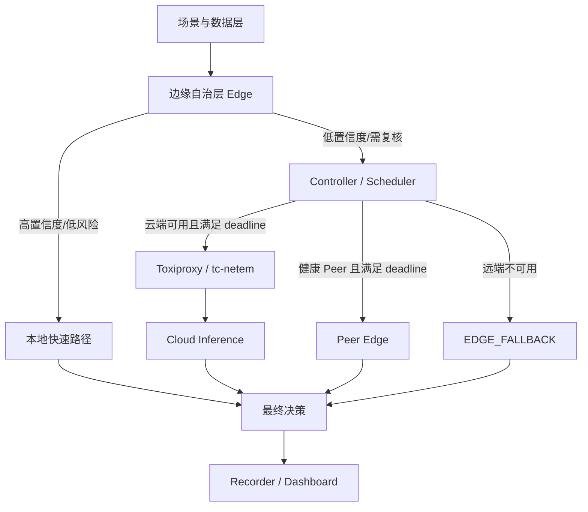

# Cloud-Edge Decision System

面向 XH-202606 赛题的云边协同感知与决策原型。项目采用 **边缘自治 + 中央协同调度 + 云端增强** 架构，验证五条核心路径：

- `EDGE`：高置信度、低风险任务由边缘端直接处理；
- `CLOUD`：低置信度任务在网络可用时交给云端增强推理；
- `PEER_EDGE`：满足 deadline 的健康邻近边缘节点协同推理；
- `EDGE_FALLBACK`：云端不可用或超时时，执行本地保守降级；
- `EDGE_SAFETY`：高风险任务在边缘端立即执行安全动作，不等待远端。

> 当前版本：MVP v0.1。默认使用可解释规则模型，用于验证系统架构、调度路径、弱网降级和指标采集。真实 ONNX/轻量模型将在不改变服务接口的前提下替换。



## 1. 服务组成

| 服务 | 本地端口 | 职责 |
|---|---:|---|
| Edge A | 8001 | 本地推理、置信度判断、安全动作 |
| Edge B | 仅容器内 8000 | Peer 推理、心跳和一跳协同 |
| Controller | 8002 | DREAM-Route、Peer/Cloud 调用、deadline 与降级 |
| Cloud Node | 8003 | 较强的融合推理服务 |
| Recorder | 8004 | SQLite 事件日志和指标汇总 |
| Toxiproxy | 8474 / 8666 | 模拟云端链路延迟、丢包和断网 |
| Dashboard | 8080 | 展示最近决策与路由统计 |

## 2. 快速启动

前置条件：Docker Desktop 或 Docker Engine，支持 `docker compose`。

```bash
cp .env.example .env
docker compose up --build -d
```

检查服务：

```bash
curl http://localhost:8001/health
curl http://localhost:8002/health
curl http://localhost:8003/health
curl http://localhost:8004/health
```

运行五条主路径的冒烟测试：

```bash
docker compose -f docker-compose.yml -f compose.test.yml up --build -d
python scripts/smoke_test.py
```

默认 Compose 配置会关闭 `ALLOW_TEST_CONTROLS`，因此请求中的 `metadata.force_confidence`
不会影响调度。冒烟测试使用 `compose.test.yml` 显式开启该测试专用控制；不要在共享或生产环境启用它。

打开 Dashboard：

```text
http://localhost:8080
```

停止：

```bash
docker compose down
```

## 3. 手动请求

```bash
curl -X POST http://localhost:8001/v1/tasks \
  -H 'Content-Type: application/json' \
  -d '{
    "task_id": "demo-001",
    "scene": "industrial",
    "payload": {
      "temperature": 84,
      "vibration": 7.2,
      "current": 16.2,
      "log": "轴承出现间歇异响"
    },
    "risk_level": "high",
    "deadline_ms": 900,
    "metadata": {"force_confidence": 0.55}
  }'
```

默认配置会忽略 `metadata.force_confidence`。如需复现该测试路由，请先用上方的
`compose.test.yml` 覆盖启动；测试控制已应用时会写入 Edge 日志和 Recorder 决策事件的
`edge_result.reason`。

## 4. 模拟云端断开

```bash
curl -X POST http://localhost:8474/proxies/cloud \
  -H 'Content-Type: application/json' \
  -d '{"enabled": false}'
```

健康 Peer 存在时，普通低置信度任务可能转为 `PEER_EDGE`，因此“关闭云端”本身并不保证
`EDGE_FALLBACK`。冒烟脚本向 Controller 提交排除两个 Peer、deadline 足够上云的独立请求，
先确认 Toxiproxy 已关闭 Cloud，再断言该请求因云端不可用而保守降级。恢复云端：

```bash
curl -X POST http://localhost:8474/proxies/cloud \
  -H 'Content-Type: application/json' \
  -d '{"enabled": true}'
```

## 5. 本地开发与测试

```bash
python -m pip install -r requirements-dev.txt
PYTHONPATH=src pytest -q
ruff check src tests scripts
```

容器不可用时，可以分别启动各 FastAPI 服务；具体命令见 [本地测试方案](docs/TEST_PLAN.md)。

## 6. 边缘大模型基准（P3）

真实模型阶段使用 scripts/benchmark_edge_llm.py 记录模型文件大小、进程内存峰值、显存、TTFT 和生成速度。模型权重必须存放在 models/artifacts/，该目录已被 Git 忽略。

以量化 DeepSeek-R1-Distill-Qwen-1.5B 为例：

    python scripts/benchmark_edge_llm.py \
      --model models/artifacts/deepseek-r1-distill-qwen-1.5b-q4_0/deepseek-r1-distill-qwen-1.5b-q4_0.gguf \
      --context 512 \
      --gpu-layers -1 \
      --output experiments/results/edge-llm-q4.json

此脚本只记录可复现实测值；赛题的 1.5GB 内存、TTFT 和能力保持率须与全量云端模型及相同评测集进行对照后才可声明达标。

在 RTX 5070 Laptop GPU（8GB）、DeepSeek-R1-Distill-Qwen-1.5B Q4_0 GGUF 的当前开发机上，一次预热测量得到：65-token 输入、32-token 输出的模型生成总耗时 174.45ms、TTFT 6.99ms、吞吐 183.43 tok/s；CPU 对照为 16.0s TTFT、1.55 tok/s。首次 CUDA 内核初始化约 34.6s，因此服务化时需要在就绪前预热。注意：当前 Adapter 集成测量仍约 17.1 秒，说明该微基准不能外推为端到端服务指标；正式实时链路保持 `rule` 后端，需完成性能定位后才可启用 LLM。脱敏的单次原始 JSON 与采集限制见 `experiments/results/`。

边缘节点支持可选 GGUF Adapter，默认仍是稳定且无需模型运行时的 `rule` 后端。启用实际模型时配置：

```bash
EDGE_INFERENCE_BACKEND=llm
EDGE_LLM_MODEL_PATH=/absolute/path/to/model.gguf
EDGE_LLM_GPU_LAYERS=-1
EDGE_LLM_WARM_ON_START=true
```

LLM 只可细化非紧急任务；规则检测到工业 `critical` 或交通 `incident` 时，仍直接执行本地安全动作。为避免受约束自由文本造成的延迟，模型仅输出受限风险标签，系统再做确定性动作映射；模型结果的 confidence 会与规则 confidence 取较小值。该后端当前仅用于离线验证，默认 Docker 镜像不携带模型权重或 CUDA 运行时，正式 GPU 部署需使用带相应运行时的镜像并挂载模型目录。

## 7. 文档入口

当前实现与提交状态：

- [DREAM-CE 创新算法与实现边界](docs/DREAM_CE_ALGORITHM.md)
- [工业视觉技术实现方案](docs/INDUSTRIAL_VISION_TECHNICAL_IMPLEMENTATION.md)
- [系统架构摘要](docs/ARCHITECTURE.md)
- [API 设计](docs/API.md)
- [本地、冒烟与压力测试方案](docs/TEST_PLAN.md)
- [模型单次基准与限制](docs/MODEL_BENCHMARK.md)
- [2026-08-30 提交状态与证据清单](docs/SUBMISSION_STATUS_2026-08-30.md)
- [压力测试、指标口径与待确认问题](docs/STRESS_TEST_AND_METRICS_REVIEW.md)
- [算法与模型设计](docs/ALGORITHM_AND_MODEL_DESIGN.md)
- [算法与模型设计阶段报告](docs/ALGORITHM_AND_MODEL_DESIGN_STAGE_REPORT.md)

研究设计与后续实现规格：

- [云边调度模块调研与设计](docs/CLOUD_EDGE_SCHEDULING_MODULE.md)
- [调度器技术规格](docs/SCHEDULER_TECHNICAL_SPEC.md)
- [完整系统设计](docs/SYSTEM_DESIGN.md)
- [Roadmap](docs/ROADMAP.md)
- [阶段状态记录](docs/WEEKLY_STATUS.md)
- [仓库结构规范](docs/REPOSITORY_STRUCTURE.md)
- [架构决策记录](docs/decisions/)

## 8. 当前边界

当前已提供双 Edge 一跳 Peer 转发、节点心跳、DREAM-Route 候选排序、确定性证据仲裁、有限 deadline 回退和指标采集。工业视觉/交通真实数据、在线资源采样、弱网矩阵、带真值冲突实验和边缘大模型能力对照仍待完成；文档中的比赛阈值均为目标，除非 `docs/evidence/` 有对应环境、commit 和原始输出，否则不代表已经达标。
