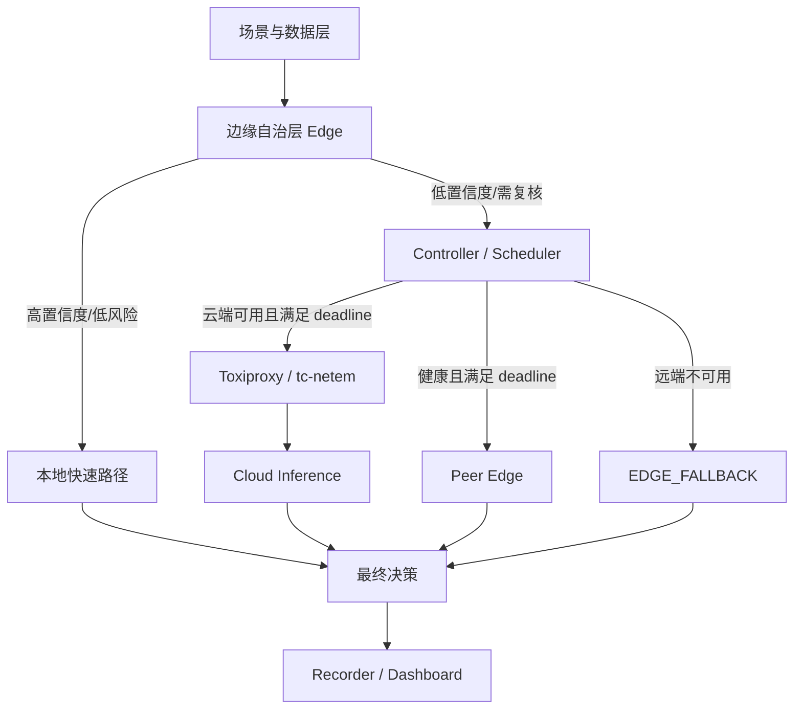
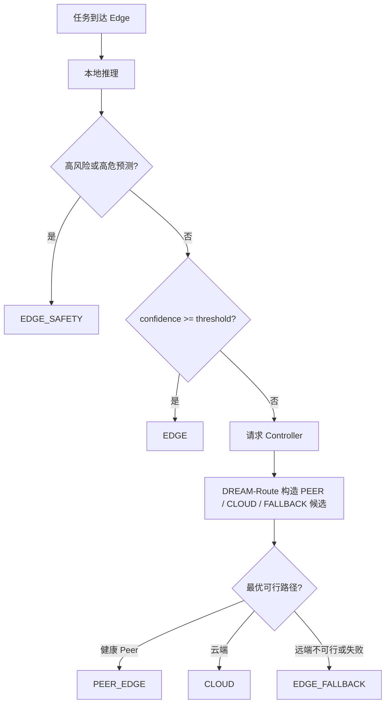
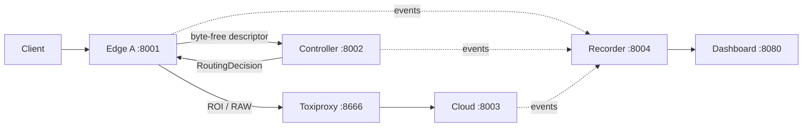

# 系统架构设计

> 版本：v1.0  
> 状态：架构定稿，MVP 原型代码已实现；当前 commit 的 Compose 实测待完成

## 1. 架构结论

采用 **边缘自治 + 中央协同调度 + 云端增强** 的分层架构。

传感器或客户端首先将任务交给边缘节点。边缘节点独立完成高置信度、低风险任务和紧急安全动作；只有不确定任务才请求 Controller。Controller 根据任务风险、剩余时间预算、请求携带的网络快照和节点心跳信息，对云端、其他边缘节点和本地降级统一评分。



## 2. 关键原则

1. Client/Sensor 的首跳是 Edge，不是 Controller；
2. Controller 是协同控制面，不是所有请求的必经数据面；
3. 云端和 Controller 故障时，Edge 必须维持基本业务；
4. Edge 不进行自由递归转发，Peer Edge 由 Controller 统一选择；
5. 模型、场景和云端供应方通过 Adapter 解耦；
6. 日志、Ground Truth 和实验指标从第一版开始设计；
7. 高风险任务的本地安全动作优先于云端复核。

## 3. 组件

### Edge Node

- Preprocessor：输入校验与特征构造；
- Model Adapter：规则、XGBoost、ONNX、量化小模型的统一接口；
- Confidence & Risk：生成预测、置信度、风险和耗时；
- Local Policy：本地直返、紧急安全动作和保守降级；
- Resource Agent：当前通过环境变量上报负载、队列、预估时延和模型版本；真实在线采样待接入；
- Local Store：后续实现断网缓存和恢复同步。

### Controller

输入：任务、边缘结果、已消耗时间、网络/云端状态。  
输出：`CLOUD`、`PEER_EDGE` 或 `EDGE_FALLBACK`，并给出 `decision_reason`。

### Cloud Node

- 复杂任务推理；
- 多源信息融合；
- 后续冲突仲裁；
- 后续下发阈值、规则和模型版本。

### Recorder & Dashboard

Recorder 作为单写者写入 SQLite，避免多个服务直接并发写同一数据库。Dashboard 只读取 Recorder API。

## 4. 决策流程



当前在线规则可简化为：

```python
if task.risk_level == "critical" or edge_result.prediction is critical:
    return EDGE_SAFETY
if edge_result.confidence >= local_threshold:
    return EDGE
plan = rank(peer_candidates + [cloud, fallback], risk, network, load, deadline)
for route in plan:
    refresh_remaining_deadline()
    if route is feasible and remote_call_succeeds(route):
        return route
return conservative_local_fallback()
```

Edge 心跳现在上报在线 CPU、RSS、可用时的 GPU/显存、真实等待队列、服务时延以及实际远端
请求形成的 RTT/带宽 EWMA；没有在线样本时仍使用受控默认值。抖动、包级丢包与路径可用率的
正式画像仍需冻结环境探针。带图像的 `/v1/tasks` 默认收集可用 Peer 结果并调用 DREAM-Fuse；
无图像的兼容路径保持原有单目标升级行为。

## 5. 本地部署



所有节点可以在一台电脑上通过 Docker Compose 模拟。视觉路径中 Toxiproxy 位于 Edge 到
Cloud 的数据面，只影响被测试的云端链路，不修改整台开发机的网络。

## 6. 多节点扩展约束

- Node Registry + 心跳上报；
- 节点 ID 与目标地址始终匹配静态白名单；共享部署再启用心跳令牌；
- 所有 Peer 选择由 Controller 完成；
- `hop_count <= 1`；
- `visited_nodes` 防止重复访问；
- 单 worker 下视觉任务按 `task_id + request SHA-256` 持久化软件终态；同 ID 异载荷拒绝，
  不代表 PLC 动作 exactly-once；
- 超过 deadline 立即降级；
- 仲裁使用 DREAM-Fuse：校准置信度 × 节点可靠度 × 新鲜度 × 时空一致性 × 版本系数；
- 高风险且证据充分时立即执行保守安全动作；普通低共识冲突请求云复核；
- `resolution_success`（自主形成结果）与带 ground truth 的正确解决率分开统计。
- P0 按 `task_id` 关联同任务的多 Peer 证据；跨工位关联仍待上游契约；
- 真值在推理结束后通过 Recorder 独立附加，不参与模型推理或调度。
