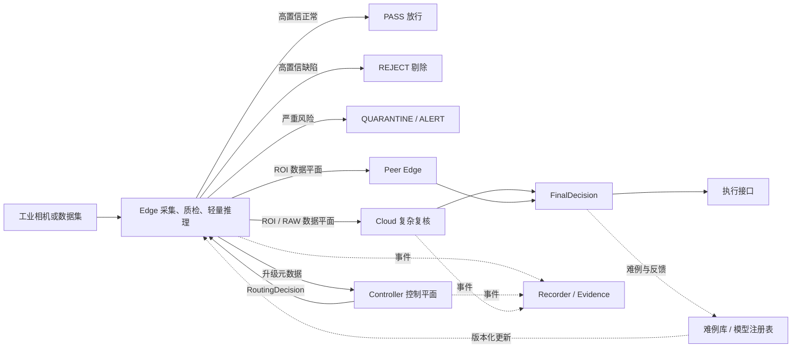

# 工业视觉检测云边协同技术落实稿

> 版本：v0.1
>
> 日期：2026-08-06
>
> 状态：技术基线，供架构评审、任务拆分和后续实现使用
>
> 适用范围：工业零部件表面缺陷检测主场景

## 1. 结论与边界

系统采用“边缘自治、中央协同、云端增强、安全回退”的分支式架构：

- Edge 接收相机图像并完成全量实时筛查；
- 高置信正常和高置信已知缺陷在 Edge 闭环；
- 严重风险由 Edge 先执行隔离或报警，Cloud 只做异步复核；
- 低置信、未知缺陷、边缘过载和多工位冲突任务才提交 Controller 选路；
- Controller 只接收任务元数据和边缘推理摘要，不承载原始图像中转；
- ROI 或必要原图由 Edge 按 Controller 返回的目标地址直传 Cloud 或 Peer Edge；
- Cloud 输出结构化复核结果，并将难例、阈值建议和模型版本反馈到边缘侧更新流程。

当前仓库已经具备 Edge、Controller、Cloud、Recorder、Dashboard、Peer Edge、回退和仲裁骨架，但仍存在两项必须正视的差距：

1. 当前 `industrial` Adapter 使用温度、振动和电流规则，不是真实图像模型；
2. 当前 Controller 直接调用 Cloud，仍混合了部分控制平面和数据平面职责。

因此，近期目标不是推翻现有服务，而是保留调度与故障处理骨架，新增视觉数据契约、视觉 Model Adapter 和 Edge 直传远端的数据链路。

## 2. 可交付系统边界

### 2.1 MVP 要实现

- 单张图像或相机帧输入；
- 图像质量检查、ROI 生成和轻量模型推理；
- `PASS`、`REJECT`、`QUARANTINE`、`ALERT` 四类业务动作；
- `EDGE`、`EDGE_SAFETY`、`CLOUD`、`PEER_EDGE`、`EDGE_FALLBACK` 五类执行路径；
- `METADATA`、`ROI`、`RAW` 三种上传粒度；
- deadline、网络、节点负载、风险和模型不确定性的联合选路；
- Cloud 超时、断网和 Controller 不可用时的保守回退；
- 每个任务可通过 `trace_id` 还原完整处理过程；
- 可复现的四组基线实验和弱网故障实验。

### 2.2 MVP 暂不实现

- 连续视频流的全套生产化接入；
- 自研视觉基础模型或从零训练多模态大模型；
- 强化学习调度；
- Kubernetes、复杂共识协议和跨地域多活；
- 真实 PLC 全协议集成；
- FEATURE 特征上传。FEATURE 会耦合边云模型版本、特征维度和算子实现，待 ROI 链路稳定后再评估。

## 3. 总体架构与数据流



控制平面只交换小体积 JSON；图像数据不经过 Controller。单机 Docker Compose 演示时也应保持同样的逻辑边界，不能因为服务运行在同一台机器上而省略目标地址和上传模式字段。

## 4. Edge 技术细节

### 4.1 处理流水线

```text
Acquire -> Validate -> Normalize -> QualityGate -> EdgeModel
        -> Uncertainty/Risk -> LocalAction or Escalation -> Evidence
```

各步骤职责如下：

| 步骤 | 输入 | 输出 | 失败策略 |
|---|---|---|---|
| Acquire | 文件、HTTP 上传或相机帧 | `frame_id`、图像、采集时间 | 采集失败记录事件，不生成质量结论 |
| Validate | 图像字节 | 格式、尺寸、校验和 | 非法输入返回 4xx；重复任务按 `task_id` 幂等返回 |
| Normalize | 原图 | 去畸变、色彩/尺寸统一图 | 使用模型版本绑定的预处理配置 |
| QualityGate | 规范化图像 | 清晰度、亮度、遮挡、曝光分数 | 不合格图像进入 `QUARANTINE`，不得当成正常样本 |
| EdgeModel | 图像或 ROI | 框/掩码、类别、异常分数 | 推理异常进入 `EDGE_FALLBACK` |
| Uncertainty/Risk | 模型输出与工艺规则 | 不确定性、风险等级 | 高风险规则优先于模型置信度 |
| LocalAction | 已确认结果 | PASS/REJECT/ALERT | 动作事件必须独立记录，可用软件模拟 |

### 4.2 模型路线

第一阶段采用可替换的双路线 Adapter，不把系统绑定到单一模型：

| 场景 | 建议基线 | Edge 输出 | 部署方式 |
|---|---|---|---|
| 已知缺陷且有框标注 | 轻量目标检测/分割模型 | 类别、置信度、bbox/mask | ONNX Runtime；NVIDIA 设备可换 TensorRT，Intel 工控机可换 OpenVINO |
| 缺陷稀少或未知 | EfficientAD 或 PatchCore 基线 | image score、pixel map、异常 ROI | Anomalib 训练与导出，Edge 使用 ONNX/OpenVINO 推理 |

选型原则：先选一类工件和固定缺陷集合跑通完整系统，再比较 YOLO 系轻量检测器、EfficientAD、PatchCore 等候选。模型名称、许可证、输入尺寸、预处理、量化方式和数据集许可必须登记到模型清单，不能只记录权重文件名。

### 4.3 推理输出与不确定性

Edge 结果至少包含：

- `prediction`：正常、已知缺陷类别或 `unknown_anomaly`；
- `confidence`：经过验证集校准的置信度；
- `top1_top2_margin`：分类前两名差值；
- `entropy`：类别分布熵；
- `anomaly_score`：异常检测分数；
- `bbox` 或 `mask_ref`：疑似区域；
- `image_quality`：清晰度、亮度、曝光和遮挡结果；
- `model_name`、`model_version`、`preprocess_version`；
- `edge_latency_ms`。

初始路由阈值必须放在配置文件中，并通过验证集标定，不能硬编码为论文或厂商示例值。推荐的初始判定结构是：

```text
if image_quality.failed:
    action = QUARANTINE
elif critical_region_hit or severe_defect_rule:
    action = ALERT or QUARANTINE
    route = EDGE_SAFETY
elif normal_confidence >= T_normal and anomaly_score < T_anomaly_low:
    action = PASS
    route = EDGE
elif defect_confidence >= T_defect and severity >= reject_level:
    action = REJECT
    route = EDGE
else:
    request Controller routing
```

为避免单一 confidence 失真，升级分数可先采用可解释组合：

```text
uncertainty = 0.45 * entropy_norm
            + 0.30 * (1 - top1_top2_margin)
            + 0.25 * anomaly_boundary_distance
```

各项必须归一化到 `[0, 1]`。权重属于初始工程参数，后续通过消融实验调整。

## 5. Controller 技术细节

### 5.1 两阶段选路

第一阶段执行硬约束：

1. 高风险或关键区域缺陷：立即 `EDGE_SAFETY`，可异步 Cloud 复核；
2. Edge 结果满足本地接受条件：`EDGE`；
3. 剩余 deadline 小于远端最小预算：`EDGE_FALLBACK`；
4. 节点不健康、模型不兼容或 hop 已达上限：从候选集中移除；
5. 图像质量失败：`QUARANTINE`，不允许低质量图像被 Cloud 判为 PASS 后直接放行。

第二阶段只对可行候选路径计算代价：

```text
J(route) = wL * latency_ratio
         + wE * expected_error_risk
         + wB * upload_size_ratio
         + wQ * queue_and_load
         + wF * failure_risk
```

其中：

- `latency_ratio = estimated_finish_ms / remaining_deadline_ms`；
- `expected_error_risk` 同时受任务风险和候选模型历史可靠度影响；
- `upload_size_ratio` 使用实际编码后字节数估算；
- `queue_and_load` 使用心跳中的队列、CPU/GPU 和显存数据；
- `failure_risk` 使用可用率、RTT、抖动、丢包率和近期失败窗口计算。

所有权重、输入快照、候选得分和剔除原因都写入 `RoutingDecision`，以支持复现和答辩解释。

### 5.2 上传粒度

| 模式 | 适用条件 | 内容 |
|---|---|---|
| `METADATA` | Cloud 只需进行跨工位/批次判断 | Edge 结果、质量分数、bbox、模型版本、工件上下文 |
| `ROI` | 已定位疑似缺陷且局部信息足够 | 带上下文边距的缺陷裁剪 + 元数据 |
| `RAW` | ROI 不可靠、全局结构相关或图像质量复核 | 必要原图 + 元数据 |

默认优先 `ROI`。ROI 应围绕 bbox 扩展 10%-20% 上下文，并裁剪到图像边界；如果 bbox 过小、目标分散或缺陷与全局装配关系相关，则升级为 `RAW`。具体扩展比例作为配置项并在实验中记录。

### 5.3 Peer Edge 约束

- 仅由 Controller 选择 Peer；
- `hop_count <= 1`；
- `visited_nodes` 防止环路；
- Peer 必须支持相同场景，并声明兼容的输入和模型版本；
- Peer 结果不自动覆盖高风险本地动作；
- 请求、返回和重试均以 `task_id` 幂等。

## 6. Cloud 技术细节

Cloud 的职责不是重新处理全部生产图像，而是处理低频疑难任务：

1. 对 ROI 进行高精度检测、分割或细粒度分类；
2. 结合整图、工件结构和多工位结果进行复核；
3. 对未知异常输出结构化描述；
4. 检索产品规范、缺陷定义、处置规则和历史案例；
5. 输出难例标签、阈值建议和再训练候选，不直接在线修改 Edge 模型。

视觉语言模型只能作为解释和知识增强模块，不能替代微小缺陷检测器。建议调用顺序为：高精度视觉模型定位/分类 -> 规则与知识检索 -> 可选视觉语言模型生成结构化解释。

Cloud 输出使用受约束 JSON：

```json
{
  "final_label": "surface_scratch",
  "location": {"bbox": [312, 184, 428, 251]},
  "severity": "medium",
  "action": "QUARANTINE",
  "possible_causes": ["fixture_friction", "transport_collision"],
  "recommended_action": "manual_reinspection",
  "evidence_refs": ["roi-sha256:...", "case:QC-2026-0182"],
  "model_version": "cloud-vision-v1",
  "confidence": 0.91
}
```

模型自由文本不得直接驱动 PLC 或生产动作；动作必须由确定性策略根据 `severity`、风险规则和允许动作集合映射。

## 7. 统一数据契约

### 7.1 TaskEnvelope

```json
{
  "task_id": "01J...",
  "trace_id": "01J...",
  "workpiece_id": "WP-20260806-00021",
  "station_id": "surface-a",
  "batch_id": "B-20260806-01",
  "captured_at": "2026-08-06T08:10:21.123Z",
  "deadline_ms": 200,
  "risk_level": "medium",
  "image": {
    "frame_id": "cam-a-128881",
    "width": 2448,
    "height": 2048,
    "mime_type": "image/jpeg",
    "sha256": "...",
    "local_ref": "spool://cam-a/128881.jpg"
  },
  "context": {
    "product_type": "part-a",
    "camera_id": "cam-a",
    "line_speed": 1.4
  }
}
```

### 7.2 RoutingDecision

```json
{
  "task_id": "01J...",
  "route": "CLOUD",
  "target_node": "cloud-vision-a",
  "target_endpoint": "http://cloud-vision-a:8000/v1/vision/review",
  "upload_mode": "ROI",
  "timeout_ms": 126,
  "estimated_finish_ms": 104,
  "decision_reason": "uncertain_roi_cloud_within_deadline",
  "policy_version": "routing-v1",
  "candidate_scores": {"CLOUD": 0.42, "PEER_EDGE": 0.58, "EDGE_FALLBACK": 0.91}
}
```

### 7.3 FinalDecision

```json
{
  "task_id": "01J...",
  "trace_id": "01J...",
  "final_label": "surface_scratch",
  "severity": "medium",
  "action": "QUARANTINE",
  "source_path": "EDGE_THEN_CLOUD",
  "conflict_status": "none",
  "model_versions": {"edge": "efficientad-int8-v1", "cloud": "cloud-vision-v1"},
  "total_latency_ms": 143.7,
  "deadline_met": true,
  "degraded": false
}
```

## 8. 故障状态机与缓存补传

任务状态建议统一为：

```text
RECEIVED -> EDGE_INFERRED -> LOCAL_FINAL
                         -> ROUTING -> REMOTE_PENDING -> REMOTE_FINAL
                                              | timeout/failure
                                              v
                                         FALLBACK_FINAL
                         -> SAFETY_FINAL -> ASYNC_REVIEW_PENDING
```

故障处理规则：

- Controller 不可用：Edge 在剩余 deadline 内停止等待，执行保守动作；
- Cloud/Peer 超时：不接受迟到结果覆盖已执行的现场动作，只记录为异步证据；
- 断网：将 ROI、任务元数据和事件写入本地 outbox，恢复后按优先级补传；
- 重试：仅对幂等接口执行有限重试，重试次数和退避时间不得突破 deadline；
- 磁盘压力：优先保留高风险、冲突和误检样本，普通正常图像按保留策略淘汰；
- 补传数据必须带原始 `task_id`、校验和、模型版本和首次采集时间。

## 9. 模型与策略更新闭环

```text
疑难/冲突样本 -> Cloud 或人工确认 -> 难例库
-> 离线训练与评估 -> 模型注册 -> 灰度部署 -> 回滚或全量发布
```

每个更新包至少包含：

- 模型文件 SHA-256；
- 模型、预处理和标签字典版本；
- 支持的设备和推理后端；
- 输入尺寸、量化方式和校准集版本；
- 离线指标与回归测试结果；
- 生效时间、灰度范围和回滚版本。

Cloud 不直接下发“自动生效的新阈值”。阈值和策略建议先进入配置评审或灰度实验，验证严重缺陷漏检率、P95 时延和升级比例没有恶化后再发布。

## 10. 部署建议

### 10.1 开发和竞赛演示

- Python 3.12、FastAPI、Pydantic；
- HTTP/JSON 控制接口；
- Docker Compose 编排；
- ONNX Runtime/OpenVINO 作为首个真实 Edge 推理后端；
- SQLite + 单写 Recorder 保存事件；
- Toxiproxy 模拟 Controller 到 Cloud 的延迟、丢包和断网；
- Dashboard 展示路径、时延、上传量、错误和模型版本。

### 10.2 现场设备映射

| 设备 | 推荐后端 | 备注 |
|---|---|---|
| Intel 工业 PC | OpenVINO FP16/INT8 | 量化后必须重新测召回率和异常定位指标 |
| NVIDIA Jetson/工业 GPU | TensorRT FP16/INT8 | 固定 CUDA/TensorRT/驱动兼容矩阵 |
| 通用 CPU | ONNX Runtime | 作为兼容基线和故障回退后端 |

相机接入通过独立 `CameraAdapter` 屏蔽厂商差异。MVP 先支持文件/HTTP 图像输入，随后再增加 GenICam 或厂商 SDK；相机 SDK 不进入调度器和模型代码。

## 11. 安全、隐私与可追溯

- 默认只上传 ROI，不上传全量原图；
- 图像、ROI、推理结果和模型包均记录 SHA-256；
- 服务间至少使用 API 身份凭据，正式部署使用 mTLS；
- 记录谁在何时使用哪个模型和策略做出何种动作；
- 原图、ROI 和事件分别配置保留期；
- 对上传失败、校验失败、模型版本不兼容和重复任务设置独立事件类型；
- 数据集许可和模型许可证单独登记。公开科研数据集不能默认推定为可商用生产数据。

## 12. 实验与验收口径

四组固定基线：

1. `Cloud-only`：全部图像发送 Cloud；
2. `Edge-only`：全部在 Edge 完成；
3. `Fixed Cascade`：固定 confidence 阈值决定是否上云；
4. `Full Scheduler`：多约束调度、分级上传、回退和冲突仲裁。

至少覆盖以下扰动：正常网络、额外 100 ms/300 ms 时延、10% 丢包、短时断网、Cloud 不可用、Edge/Cloud 过载、多工位冲突、重复请求和乱序返回。

| 类别 | 指标 | 必要证据 |
|---|---|---|
| 检测效果 | Precision、Recall、F1、AUROC/AUPRO、严重缺陷漏检率 | 逐样本 CSV、混淆矩阵、错误案例 |
| 实时性 | 平均、P50、P95、P99、deadline 达成率 | trace 级阶段耗时 |
| 通信 | 上云比例、ROI/RAW 比例、单任务字节、总带宽 | 上传事件和网络统计 |
| 稳定性 | 弱网完成率、回退成功率、超时率、恢复时间 | 故障注入与状态迁移日志 |
| 一致性 | 冲突率、解决成功率、重复决策率 | 多工位关联表和仲裁记录 |
| 资源 | CPU/GPU、显存、内存、队列深度、功耗（可选） | 节点心跳与采样 CSV |

任何目标数值在完成可复现实验前都只能标注为“目标”或“官方约束”，不能写成系统已达到的性能。

## 13. 与当前仓库的实施差距

| 优先级 | 当前状态 | 要补的内容 | 完成判据 |
|---|---|---|---|
| P0 | `industrial` 为设备遥测规则 | 新增图像任务契约和 `VisionModelAdapter` | 文件图像能得到 bbox/score/quality/result |
| P0 | 数据对象缺少工件和图像字段 | 增加 `trace_id`、`workpiece_id`、`station_id`、`batch_id`、image/ROI 描述 | OpenAPI、单测和示例同步 |
| P0 | Controller 直接调用 Cloud | Controller 返回目标和上传模式，Edge 直传数据 | Controller 日志不出现图像字节；ROI 路径端到端通过 |
| P0 | 回退只返回决策 | 增加本地 outbox 和恢复补传 | 断网任务可在恢复后补传且不重复执行动作 |
| P1 | 已有动态代价函数 | 接入真实 RTT、队列、负载和上传字节 | 路由日志含输入快照、候选得分和剔除原因 |
| P1 | 已有 Peer 与仲裁骨架 | 用 `workpiece_id + station_id` 关联多工位结果 | 冲突、重复、乱序用例自动化通过 |
| P1 | Cloud 仍是规则融合 | 增加高精度视觉 Adapter 和受约束结构化输出 | ROI 复核可替换模型且接口不变 |
| P1 | Recorder 已有事件记录 | 补充阶段耗时、字节数、版本、deadline 和 ground truth 字段 | 可直接导出四组基线 CSV |
| P2 | 无模型发布闭环 | 模型注册、灰度、签名校验和回滚 | 不重启整体系统即可安全切换并回滚 Edge 模型 |

## 14. 推荐实施顺序

1. 冻结视觉任务、结果、路由和最终决策四类数据对象；
2. 新增文件图像输入与 Mock Vision Adapter，先跑通真实图像字节链路；
3. 接入一个真实 Edge 基线模型，输出 bbox 或 anomaly map；
4. 改造 Controller 为纯控制平面，完成 ROI 直传 Cloud；
5. 完成本地 outbox、超时和恢复补传；
6. 接入 Cloud 高精度复核 Adapter；
7. 跑通 Edge、Cloud、Fallback 三条主路径并导出 trace；
8. 再扩展 Peer Edge、多工位冲突和第二场景；
9. 最后执行四组基线、弱网和资源实验。

第一阶段最小验收不以模型精度最优为目标，而以“真实图像输入、本地结论、ROI 上云、远端超时回退、完整证据链”五项同时成立为准。

## 15. 待团队冻结的五个决策

1. 首个工件类别和缺陷集合；
2. Edge 硬件基线（Intel 工业 PC、Jetson 或通用开发机）；
3. 现场动作采用软件模拟、IO 接口还是 PLC 协议；
4. 第二场景的最低实现范围；
5. 官方对视觉指标与“边侧轻量大模型”指标的最终接受口径。

这些决策会影响数据集、模型后端、deadline、动作策略和验收口径。在未冻结前，接口保持通用，但不要同时实现多套重模型路线。
