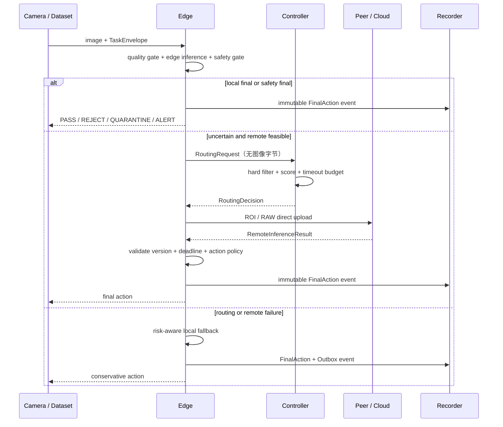
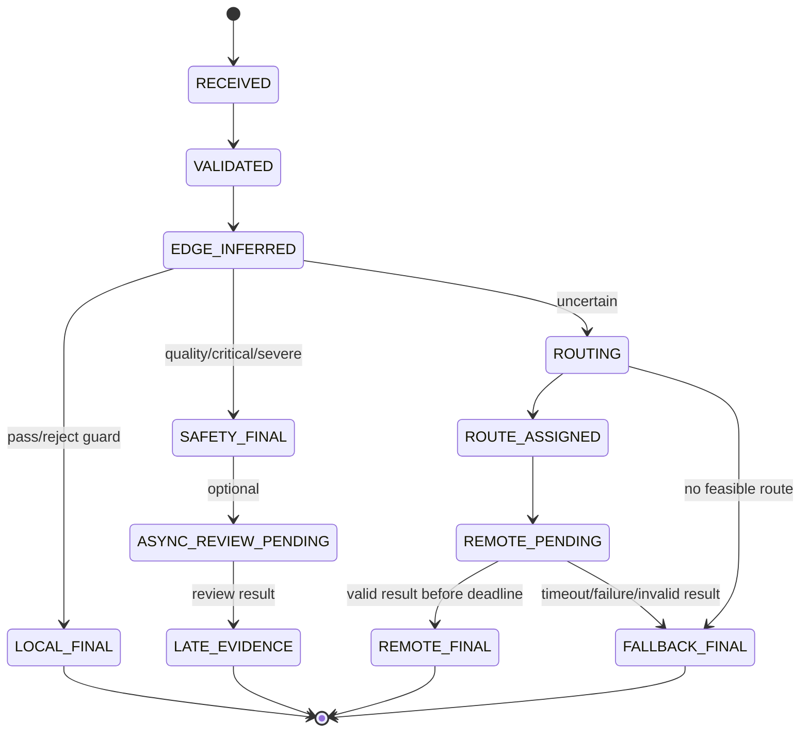

# 云边协同动态调度器实现规格

> 范围说明：本规格覆盖完整可扩展调度器。默认 MVP 禁用 `PEER_EDGE`，只验收
> EDGE、EDGE_SAFETY、CLOUD 和 EDGE_FALLBACK；Peer 条款仅用于后期扩展。

> 版本：v0.1
> 日期：2026-08-10
> 状态：匿名实现规格；参数为首轮实验种子，不代表已经达到竞赛指标
> 关联文档：`CLOUD_EDGE_SCHEDULING_MODULE.md`、`INDUSTRIAL_VISION_TECHNICAL_IMPLEMENTATION.md`

推荐阅读顺序：算法实现看第 3-9 节；服务与可靠性看第 10-12 节；证据和实验看第 13-14 节；开发拆分与测试看第 15-16 节。

## 1. 规格目标与实现边界

调度器接收边缘模型摘要、任务约束、网络遥测和节点遥测，输出一个可执行且可复核的联合决策：

```text
decision = (route, target_node, upload_mode, timeout_ms, fallback_action)
```

其中：

- `route ∈ {EDGE, EDGE_SAFETY, PEER_EDGE, CLOUD, EDGE_FALLBACK}`；
- `upload_mode ∈ {NONE, METADATA, ROI, RAW}`；
- 每个同步任务最多执行一次远端推理尝试；
- 现场安全动作一旦提交，不允许被迟到的 Cloud/Peer 结果覆盖；
- Controller 只做控制平面决策，图像数据由 Edge 直传目标节点；
- 工业视觉和交通视觉使用同一调度内核，只替换 Adapter、风险表和模型画像。

本文中的“必须”表示第一版竞赛系统的实现要求，“建议”表示可在首轮实验后调整的工程默认值。

## 2. 运行时拓扑与请求流程



关键约束：

1. `RoutingRequest` 只能包含图像描述、实际字节数和边缘推理摘要，不包含 Base64 图像；
2. `RoutingDecision` 必须指定具体 `target_node`，执行阶段不得再次另选节点；
3. Edge 是现场动作的唯一提交者；Controller 和 Cloud 只能建议动作；
4. Recorder 失败不能阻塞现场动作，事件先进入 Edge 本地 outbox；
5. 所有接口以 `task_id + payload_sha256` 实现幂等。

## 3. 时间、deadline 与 200ms 预算

### 3.1 Edge 单调时钟权威与跨节点预算

Edge 是端到端 deadline 的唯一运行时权威。接收任务时立即建立本机单调时钟截止点：

```text
accepted_mono_ns = monotonic_ns()
deadline_mono_ns = accepted_mono_ns + deadline_ms * 1_000_000
remaining_edge_ms() = max(0, (deadline_mono_ns - monotonic_ns()) / 1_000_000)
```

Edge 发给 Controller 的控制请求同时携带：

```text
remaining_budget_ms_at_send = remaining_edge_ms()
deadline_at_utc             = accepted_at_utc + deadline_ms  # 仅用于 trace
sent_at_utc                 = current_utc                    # 仅用于诊断时钟偏差
```

Controller 收到请求后建立自己的单调计时器，并使用保守预算：

```text
controller_budget_ms =
    remaining_budget_ms_at_send
    - control_request_oneway_p95_ms
    - controller_elapsed_ms
    - control_response_oneway_p95_ms
    - action_guard_ms
```

- UTC 不参与精确 timeout 计算，只用于跨节点事件排序和诊断；避免 NTP 跳变破坏 200ms deadline；
- Controller 和 Remote 只承诺在收到的局部预算内完成，Edge 仍在每次调用前用 `remaining_edge_ms()` 最终裁决；
- 每次 Controller/Peer/Cloud 失败后必须重新读取 Edge 单调时钟，不能复用入口时的旧预算；
- E2E 起止 `t_input_accepted` 和 `t_action_ready` 都由 Edge 的同一个单调时钟记录；
- 所有节点仍应启用 NTP/PTP，以改善 trace 对齐；首版日志记录估计时钟偏差，但不依赖它保证 deadline；
- `elapsed_ms` 仅作旧接口兼容，不能继续作为跨节点唯一预算字段。

### 3.2 工业视觉 200ms 初始预算

| 阶段 | P95 预算 | 计时边界 |
|---|---:|---|
| 接收、校验和解码 | 8ms | 请求进入 Edge 至图像可读 |
| 预处理与图像质量门控 | 12ms | 归一化、模糊/曝光/遮挡检测 |
| Edge 推理与后处理 | 35ms | 模型调用至结构化摘要 |
| 不确定性与本地门控 | 5ms | 结果摘要至决定是否请求调度 |
| Controller 控制面往返 | 12ms | Edge 发请求至收到 RoutingDecision |
| ROI 编码 | 8ms | 裁剪、扩边、编码和 SHA-256 |
| ROI 直传 | 18ms | Edge 发起上传至远端输入可用 |
| 远端排队、推理与后处理 | 60ms | 远端接收至结构化结果 |
| 结果返回 | 15ms | 远端结果至 Edge 校验完成 |
| 现场动作提交 | 12ms | Edge 确定终态至动作可执行/ACK |
| 时钟与故障回退余量 | 15ms | 不分配给正常路径 |
| 合计 | 200ms | `t_action_ready - t_input_accepted` |

这些数值是需要用目标硬件 profiling 校准的预算，不是测量结果。某阶段超预算时，其他阶段的空闲预算可以被使用，但最后 20ms 必须保留给动作提交和本地回退。

远端超时计算：

```text
fallback_guard_ms = 5
action_guard_ms = 15
remote_timeout_ms = min(
    route_timeout_cap_ms,
    remaining_ms - fallback_guard_ms - action_guard_ms
)
```

若 `remote_timeout_ms < 40`，远端候选直接不可行。200ms profile 下默认只允许一次同步远端尝试；Peer 失败后直接回退，不再串行尝试 Cloud。只有重新计算后仍有完整第二次预算时才允许第二次尝试，首版竞赛实现不启用该分支。

HTTP 客户端必须再套一层总墙钟超时，不能只设置单一 read timeout：

```text
outer_timeout = remote_timeout_ms
pool_timeout  = min(5ms, 0.10 * outer_timeout)
connect_timeout = min(15ms, 0.20 * outer_timeout)
write_timeout = min(1.20 * predicted_upload_p95, 0.35 * outer_timeout)
read_timeout  = outer_timeout - pool_timeout - connect_timeout - write_timeout
```

若 `read_timeout < 10ms`，该候选不可行。实现时使用进程单调时钟的 outer timeout 作为最终上限；HTTPX 的 connect/pool/write/read 分项 timeout 只用于更快识别故障。

## 4. 数据契约

统一单位：时间为毫秒、数据量为字节、吞吐为 bit/s、比例为 `[0,1]`。Pydantic 浮点字段必须设置范围并拒绝 NaN/Infinity；负 RTT、零/负带宽、超范围丢包等输入返回结构化校验错误或使对应远端候选不可用，禁止填入乐观默认值。

### 4.1 TaskEnvelope

| 字段 | 类型 | 约束与语义 |
|---|---|---|
| `schema_version` | semver string | 首版 `1.0`；不兼容变更升级 major |
| `task_id` | UUID/ULID string | 全局唯一；幂等键的一部分 |
| `trace_id` | UUID/ULID string | 贯穿 Edge、Controller、Remote、Recorder |
| `request_sha256` | hex string | 对规范化请求元数据与图像 SHA-256 计算，用于检测同 ID 异载荷 |
| `scene` | enum | `industrial` 或 `traffic` |
| `workpiece_id` | string | 工业工件或交通事件关联 ID；不得含个人身份信息 |
| `station_id` | string | 工位/摄像头逻辑 ID |
| `batch_id` | string/null | 批次或回放批次 |
| `captured_at_utc` | datetime | 采集时刻，UTC |
| `deadline_at_utc` | datetime | 业务截止时刻，UTC |
| `risk_level` | enum | `low/medium/high/critical` |
| `allowed_actions` | enum list | 如 `PASS/REJECT/QUARANTINE/ALERT/STOP_LINE` |
| `data_policy` | object | 允许的上传模式、敏感度、RAW 是否需显式许可及保留期 |
| `image` | ImageDescriptor | 仅 Edge 持有可读取 URI；Controller 不取图像 |
| `context` | object | 产品类型、关键区域、线速等非图像上下文 |
| `policy_hint` | object/null | 实验强制 baseline 时使用；生产路径不得由客户端任意改权重 |

`ImageDescriptor`：

```json
{
  "frame_id": "cam-a-128881",
  "width": 2448,
  "height": 2048,
  "mime_type": "image/jpeg",
  "size_bytes": 582341,
  "sha256": "hex-encoded-sha256",
  "edge_uri": "spool://cam-a/128881.jpg"
}
```

`edge_uri` 不发送给无权访问本地 spool 的目标节点。远端上传使用 Controller 签发的短时 `upload_token`，而不是暴露本地文件路径。

### 4.2 EdgeInferenceSummary

| 字段 | 类型 | 说明 |
|---|---|---|
| `prediction` | string | `normal`、已知缺陷或 `unknown_anomaly` |
| `class_probabilities` | map | 校准后的类别概率；可省略低概率类别 |
| `confidence_calibrated` | float | `[0,1]`，不可直接使用未校准 objectness 代替 |
| `entropy_norm` | float | `H(p)/log(K)` |
| `top1_top2_margin` | float | `[0,1]` |
| `anomaly_score` | float/null | 异常模型分数 |
| `uncertainty` | float | 第 5.2 节定义的组合不确定性 |
| `scene_complexity` | float | Adapter 归一化的纹理/边缘/目标密度/遮挡等任务难度 `[0,1]` |
| `image_quality` | object | blur、exposure、occlusion 及 `passed` |
| `detections` | list | class、confidence、bbox/mask_ref、severity |
| `critical_region_hit` | bool | 是否命中工艺关键区域 |
| `ood_score` | float/null | 域外/未知输入风险 |
| `roi_descriptors` | list | 每个 ROI 的坐标、扩边后大小、编码后实际字节数、SHA-256 |
| `model_version` | string | 模型与量化版本 |
| `calibration_version` | string | 温度/等距校准版本 |
| `preprocess_version` | string | 预处理版本 |
| `stage_latency_ms` | object | decode、quality、infer、postprocess |

### 4.3 RoutingRequest

```json
{
  "task_id": "01J...",
  "trace_id": "01J...",
  "route_epoch": 1,
  "request_sha256": "hex-encoded-request-sha256",
  "scene": "industrial",
  "station_id": "surface-a",
  "deadline_at_utc": "2026-08-10T08:10:21.323Z",
  "remaining_budget_ms_at_send": 142.6,
  "sent_at_utc": "2026-08-10T08:10:21.180Z",
  "risk_level": "medium",
  "data_policy": {"privacy_sensitivity": 0.5, "allowed_upload_modes": ["METADATA", "ROI"]},
  "origin_node": "edge-a",
  "hop_count": 0,
  "visited_nodes": ["edge-a"],
  "edge_summary": {
    "prediction": "unknown_anomaly",
    "confidence_calibrated": 0.61,
    "uncertainty": 0.72,
    "scene_complexity": 0.66,
    "critical_region_hit": false,
    "model_version": "edge-vision-int8-v1"
  },
  "upload_options": [
    {"mode": "METADATA", "size_bytes": 2810, "sha256": "metadata-sha256"},
    {"mode": "ROI", "size_bytes": 48320, "sha256": "roi-sha256"},
    {"mode": "RAW", "size_bytes": 582341, "sha256": "raw-sha256"}
  ]
}
```

### 4.4 RoutingDecision 与 CandidateScore

```json
{
  "decision_id": "decision-01J...",
  "attempt_id": "attempt-01J...",
  "task_id": "01J...",
  "trace_id": "01J...",
  "route_epoch": 1,
  "route": "CLOUD",
  "target_node": "cloud-vision-a",
  "target_endpoint": "http://cloud-vision-a:8000/v1/review",
  "upload_mode": "ROI",
  "upload_token": "short-lived-signed-token",
  "valid_for_ms": 15,
  "timeout_ms": 96,
  "estimated_finish_p95_ms": 91.4,
  "fallback_action": "QUARANTINE",
  "candidate_scores": [
    {
      "candidate_id": "CLOUD:cloud-vision-a:ROI",
      "feasible": true,
      "score": 0.272,
      "components": {"latency": 0.64, "error": 0.04, "bytes": 0.08, "load": 0.32, "failure": 0.05, "privacy": 0.20},
      "weights": {"latency": 0.34, "error": 0.36, "bytes": 0.08, "load": 0.06, "failure": 0.12, "privacy": 0.04},
      "estimated_accuracy_lcb": 0.92,
      "estimated_latency_p95_ms": 91.4,
      "rejection_reasons": []
    }
  ],
  "decision_reason_code": "REMOTE_QUALITY_GAIN_WITHIN_DEADLINE",
  "policy_version": "routing-v1.0.0",
  "telemetry_snapshot_id": "snap-01J..."
}
```

`valid_for_ms` 约束 RoutingDecision 的新鲜度。Edge 准备上传前若决策已过期，必须重新计算本地剩余预算并回退；200ms profile 不自动再次请求 Controller。

候选被淘汰时也必须留在 `candidate_scores` 中，`feasible=false`，并给出枚举化原因，例如：

```text
DEADLINE_INFEASIBLE
NODE_STALE
CIRCUIT_OPEN
MODEL_INCOMPATIBLE
SCENE_UNSUPPORTED
UPLOAD_MODE_FORBIDDEN
INSUFFICIENT_MEMORY
QUEUE_FULL
HOP_LIMIT
PAYLOAD_UNAVAILABLE
TELEMETRY_TOO_STALE
AVAILABILITY_BELOW_RISK_FLOOR
MODEL_QUALITY_NOT_CERTIFIED
```

### 4.5 FinalDecision

`FinalDecision` 必须同时保存模型结论和现场动作，两者不得混为一个字段：

```json
{
  "task_id": "01J...",
  "trace_id": "01J...",
  "route_epoch": 1,
  "final_label": "surface_scratch",
  "final_confidence": 0.91,
  "severity": "medium",
  "action": "QUARANTINE",
  "route": "CLOUD",
  "target_node": "cloud-vision-a",
  "upload_mode": "ROI",
  "deadline_met": true,
  "degraded": false,
  "action_epoch": 1,
  "finalized_at_utc": "2026-08-10T08:10:21.281Z",
  "total_latency_ms": 158.3,
  "model_versions": {"edge": "edge-vision-int8-v1", "remote": "cloud-vision-v1"},
  "policy_version": "routing-v1.0.0"
}
```

### 4.6 RemoteInferenceResult

```json
{
  "attempt_id": "attempt-01J...",
  "decision_id": "decision-01J...",
  "task_id": "01J...",
  "trace_id": "01J...",
  "route_epoch": 1,
  "request_sha256": "hex-encoded-request-sha256",
  "artifact_sha256": "hex-encoded-roi-sha256",
  "prediction": "surface_scratch",
  "confidence_calibrated": 0.91,
  "severity": "medium",
  "recommended_action": "QUARANTINE",
  "model_version": "cloud-vision-v1",
  "preprocess_version": "cloud-pre-v1",
  "queue_wait_ms": 11.2,
  "inference_ms": 54.7,
  "postprocess_ms": 3.1,
  "completed_at_utc": "2026-08-10T08:10:21.258Z",
  "result_sha256": "hex-encoded-result-sha256",
  "late": false,
  "evidence_refs": ["roi-sha256:..."]
}
```

Edge 必须校验 `attempt_id/decision_id/task_id/route_epoch/request_sha256/artifact_sha256`、模型契约、结果 schema 和当前 TaskState。旧 `route_epoch` 结果只能作为证据。`recommended_action` 还需经过 Edge 的确定性动作表，不能直接控制现场设备。

## 5. Edge 本地门控与置信度标定

### 5.1 标定

对于分类 logits `z`，使用独立验证集拟合温度 `T`：

```text
p_i = softmax(z_i / T)
T* = argmin_T NLL(validation_set)
```

只有单个二分类 confidence 时使用 logit 温度缩放。每个 `model_version + preprocess_version + scene` 单独保存 `calibration_version`。测试集不得重新拟合温度。

必须报告：

- ECE（建议 15 个等频 bin）；
- Brier Score；
- reliability diagram；
- risk-coverage curve；
- 各风险等级下的严重缺陷漏检率。

本地 `PASS` 阈值不是固定抄取 0.80。推荐在验证集上选择满足以下约束的最小阈值：

```text
lower_95CI(precision_normal) >= 0.995
upper_95CI(severe_defect_false_pass_rate) <= epsilon_safe
```

`epsilon_safe` 由团队按工艺风险冻结；没有足够样本支撑置信区间的类别不得自动放行，进入 `QUARANTINE` 或远端复核。

### 5.2 不确定性与场景复杂度

首版可解释组合：

```text
boundary_distance = exp(-abs(anomaly_score - anomaly_threshold) / sigma)

U = clip(
      0.45 * entropy_norm
    + 0.30 * (1 - top1_top2_margin)
    + 0.25 * boundary_distance,
    0, 1
)
```

- 无异常模型时，将前两项重新归一化，不把缺失项填 0；
- `sigma` 由异常分数验证集标准差确定，最低取 `1e-6`；
- OOD 分数不并入 `U` 后隐藏，应作为单独的安全门控项；
- 图像模糊、过曝或遮挡属于输入质量问题，不等同于模型不确定性。

工业视觉 Adapter 的首版复杂度可定义为：

```text
C = clip(
      0.25 * texture_entropy_norm
    + 0.20 * edge_density_norm
    + 0.25 * proposal_density_norm
    + 0.15 * total_roi_area_ratio
    + 0.15 * overlap_ratio,
    0, 1
)
```

除本来就在 `[0,1]` 的面积/重叠比外，其余特征用 validation 的 P05/P95 做截断归一化；参数按 `scene + product_type + camera_profile` 冻结。模糊、曝光和遮挡仍保留在 `image_quality`，不重复塞进 `C`。交通 Adapter 可以使用目标数、遮挡、运动强度和跟踪中断率，但只向调度器输出相同的 `scene_complexity ∈ [0,1]`。

### 5.3 动作门控顺序

`risk_level` 表示误判后果，`detected severity` 表示当前视觉证据检测到的缺陷严重度，必须是两个独立字段。关键工件可以具有高 `risk_level`，但不能因此让每一帧都自动触发停线；只有质量失败、关键区域命中或严重缺陷证据触发 `EDGE_SAFETY`。

```text
if image_quality.passed is false:
    final = EDGE_SAFETY / QUARANTINE
elif critical_region_hit or severe_defect_rule:
    final = EDGE_SAFETY / QUARANTINE|ALERT|STOP_LINE
    optional_async_review = true
elif pass_guard_satisfied:
    final = EDGE / PASS
elif known_defect_guard_satisfied:
    final = EDGE / REJECT
else:
    request routing
```

`pass_guard_satisfied` 至少同时满足：质量通过、非 OOD、未命中关键区域、校准后的正常概率高于该产品/缺陷组阈值。弱网、Cloud 过载和 deadline 压力都不得降低这个 `PASS` 阈值。

当前 `dynamic_local_threshold()` 的“弱网降低统一阈值”只能保留为低风险任务的升级流量控制变量，不能直接决定 `PASS`。代码迁移时应拆成 `pass_threshold`、`reject_threshold` 和 `escalation_budget_threshold` 三个概念。

### 5.4 远端不可用时的确定性回退表

| 风险 | 本地证据 | 允许终态 | 禁止行为 |
|---|---|---|---|
| low | 已通过严格 PASS guard | `PASS` | 用较低临时阈值重新放行 |
| low | 未通过 PASS/REJECT guard | `QUARANTINE` 或抽检队列 | 伪造高置信结论 |
| medium | 不确定或输入质量失败 | `QUARANTINE` | `PASS` |
| high | 任意未确认异常 | `QUARANTINE + ALERT` | 等待 Cloud 后再采取现场动作 |
| critical | 关键部位或严重规则命中 | `STOP_LINE/ALERT` | 远端结果覆盖已执行动作 |

具体动作必须与 `allowed_actions` 求交；若首选动作不被允许，使用场景策略中更保守且允许的动作。

## 6. 候选生成与硬可行性过滤

候选单位是 `(route, target_node, upload_mode)`，不是只有 `route`。例如同一个 Cloud 节点可能产生 `CLOUD:ROI` 和 `CLOUD:RAW` 两个候选。

### 6.1 上传模式规则

| 模式 | 生成条件 | 初始规则 |
|---|---|---|
| `NONE` | Edge 本地终态 | 不上传图像 |
| `METADATA` | 只做跨工位融合或规则复核 | JSON 实际序列化字节计入通信量 |
| `ROI` | 缺陷位置可靠且局部上下文足够 | bbox 置信度 ≥0.50、总 ROI 面积占比 ≤0.35；四周扩展 15% 后重新编码 |
| `RAW` | 全局装配关系、ROI 不可靠、未知分散异常 | 仅在策略与数据许可允许时生成 |

0.50、0.35 和 15% 是首轮 profiling 参数，必须记录在 `policy_version` 中并做敏感性实验。

### 6.2 硬过滤条件

任一条件不满足即淘汰，不使用“小惩罚后仍可能被选中”的方式：

1. 心跳年龄 `> node_ttl_s`；
2. 熔断器为 `OPEN`；
3. 场景、输入模式、模型版本或预处理不兼容；
4. `hop_count >= 1` 的任务再次选择 Peer；
5. `target_node` 已在 `visited_nodes`；
6. 目标队列达到 `queue_capacity`；
7. `free_memory_bytes < predicted_peak_memory_bytes * 1.20`；
8. 上传模式违反数据策略或实际 payload 不可用；
9. 遥测年龄超过 3 秒且无保守 fallback 画像；
10. `estimated_latency_p95_ms > remaining_ms`；
11. `remote_timeout_ms < 40`；
12. 目标端不支持请求的 `model_contract_version`；
13. 运行可用率下置信界低于风险门槛；
14. 该模型在对应场景/难度分桶的质量下置信界未获得该风险等级认证。

初始认证门槛可以暂设为：

```text
operational_availability_lcb:
  low/medium >= 0.80
  high       >= 0.90
  critical   不等待同步远端结果

model_quality_lcb:
  low/medium >= 0.80
  high       >= 0.90
  critical   现场先执行安全动作，远端只异步复核
```

这些只是冷启动门槛。正式值必须由业务风险和验证集冻结；没有带真值质量画像的模型不得处理高风险同步终态。

`EDGE_SAFETY` 是安全门控结果，不参加普通候选评分。`EDGE_FALLBACK` 始终存在，但其预期错误损失由风险等级和本地证据决定，不能只因为时延为 1ms 就总是得分最低。

## 7. 在线估计器

### 7.1 网络与服务时延

按 `origin_node -> target_node` 维护路径画像：

```text
T_network_p95 = RTT_p95
              + 8 * (upload_bytes + result_bytes) / bandwidth_p10_bps * 1000

T_wait_p95 = queue_depth / max(max_concurrency, 1) * service_time_p95

T_candidate_p95 = scheduler_overhead_p95
                + T_network_p95
                + T_wait_p95
                + service_time_p95(scene, model, difficulty_bin)
                + remote_postprocess_p95
                + edge_action_p95
```

- 带宽使用最近窗口 P10，避免用均值低估上传时间；
- 服务时间按 `scene + model_version + difficulty_bin + upload_mode` 分桶；
- 样本不足时退回节点全局 P95，再不足时使用配置中的保守冷启动值；
- 预测值必须同时写入日志，任务结束后记录预测误差。

对非固定采样间隔使用时间感知 EWMA：

```text
alpha_t = 1 - exp(-delta_seconds / tau_seconds)
mu_t = alpha_t * x_t + (1 - alpha_t) * mu_(t-1)
var_t = alpha_t * (x_t - mu_(t-1))^2 + (1 - alpha_t) * var_(t-1)
p95_t = mu_t + 1.645 * sqrt(var_t)
```

首轮建议资源/队列 `tau=5s`，网络同时维护 `fast tau=5s` 与 `slow tau=60s`。窗口还应保留最近 60 个原始样本；样本不少于 30 时，调度取 `max(fast_p95, slow_p95, empirical_rolling_p95)`，避免突刺被均值或正态近似掩盖。样本不足时使用配置中的保守冷启动 P95。发生模型版本切换时不得沿用旧服务时间画像。

### 7.2 节点负载

```text
Q = weighted_mean(
    cpu_util,
    gpu_util,
    memory_pressure,
    gpu_memory_pressure,
    queue_depth / queue_capacity
)
```

建议初始权重：队列 0.35、GPU 0.25、CPU 0.15、GPU 显存 0.15、内存 0.10。无 GPU 节点删除 GPU 两项并将其余权重重新归一化。所有值先限制到 `[0,1]`；NaN、Infinity、负值和解析失败均使该字段不可用，不能直接进入排序。

### 7.3 路径可用率与熔断

每条路径维护最近 100 次调用结果，并使用 Beta 先验得到成功率：

```text
availability_mean = (success + 8.5) / (success + failure + 10)
availability_lcb = BetaQuantile(0.05, success + 8.5, failure + 1.5)
failure_risk = 1 - availability_lcb
```

候选评分使用下置信界而不是乐观均值。调用只在得到合法、按时且 schema 校验通过的结果时记为成功。

当前运行时依赖中没有 SciPy。MVP 不新增重型数值依赖时，可对加入先验伪计数后的成功率使用单侧 95% Wilson 下界，`z=1.645`：

```text
p = s / n
LCB = (
    p + z^2/(2n)
    - z * sqrt(p*(1-p)/n + z^2/(4n^2))
) / (1 + z^2/n)
```

这里 `s=success+8.5`、`n=success+failure+10`。若后续引入经过锁版的统计库，再将实现切换为 Beta posterior quantile；算法版本和实验配置必须随之升级，不能混用两种 LCB 结果。

熔断默认值：

- 10 秒内连续 3 次失败：`CLOSED -> OPEN`；
- 首次 `OPEN` 5 秒后进入 `HALF_OPEN`；重复开启按 5、10、20、40、60 秒指数退避；
- `HALF_OPEN` 只放行 1 个低风险探测请求；
- 连续 2 次成功后恢复 `CLOSED`，任一次失败重新 `OPEN`；
- 高风险任务不得作为半开探测流量。

### 7.4 模型可靠度与预期准确率

模型质量仅在获得人工标注、测量设备或独立验证流程确认的真值后更新；Cloud 输出本身不能自动充当 ground truth。按以下 key 分桶：

```text
(scene, model_version, defect_group, difficulty_bin, upload_mode, confidence_bin)
```

为避免小样本过拟合，采用向全局画像收缩：

```text
A_hat = n / (n + k) * accuracy_bin
      + k / (n + k) * accuracy_global
k = 30
```

调度使用 `A_hat` 的 95% 下置信界。分桶样本少于 30 时，日志标记 `quality_source=GLOBAL_PRIOR`；没有带真值数据时使用保守配置值并标记 `UNVERIFIED`，不得在报告中称为实测准确率。

## 8. 动态评分

### 8.1 归一化代价

对已经通过硬过滤的候选 `j`：

```text
L_j = clip(T_candidate_p95_j / remaining_ms, 0, 1)
E_j = clip(risk_cost * (1 - accuracy_lcb_j), 0, 1)
B_j = clip(upload_bytes_j / raw_image_bytes, 0, 1)
Q_j = node_load_j
F_j = 1 - availability_lcb_j
P_j = privacy_sensitivity * exposure(upload_mode)
```

`risk_cost` 初始映射为 `low=0.25, medium=0.50, high=0.80, critical=1.00`。Critical 通常已经被安全门控拦截；如果进入评分，只能表示现场安全动作已经执行，远端任务是异步复核。

`exposure(NONE/METADATA/ROI/RAW)` 初始取 `0/0.05/0.40/1.00`。数据策略禁止的上传模式已经在硬过滤阶段删除；`P` 只用于比较仍被允许的模式。

总成本：

```text
J_j = wL * L_j + wE * E_j + wB * B_j + wQ * Q_j + wF * F_j + wP * P_j
```

首轮基础权重：

```text
bL=0.25, bE=0.30, bB=0.10, bQ=0.10, bF=0.20, bP=0.05
```

### 8.2 任务相关权重

定义：

```text
D = clip(1 - remaining_ms / original_deadline_ms, 0, 1)
R = {low:0.25, medium:0.50, high:0.80, critical:1.00}
U = edge uncertainty in [0,1]
C = scene complexity in [0,1]
N = network degradation in [0,1]
S = privacy sensitivity in [0,1]
```

未归一化权重：

```text
uL = bL * (1 + 1.5 * D)
uE = bE * (1 + 1.5 * R + 1.0 * U + 0.5 * C)
uB = bB * (1 + 1.0 * N)
uQ = bQ
uF = bF * (1 + 1.5 * N + 0.5 * R)
uP = bP * (1 + 2.0 * S)

wX = uX / sum(uL, uE, uB, uQ, uF, uP)
```

网络退化：

```text
N = clip(
      0.35 * (1 - availability_lcb)
    + 0.30 * packet_loss
    + 0.20 * clip(RTT_p95 / 200, 0, 1)
    + 0.15 * clip(jitter_p95 / 100, 0, 1),
    0, 1
)
```

这些系数是可复现的初值，必须通过验证集/网络 trace 标定，并在正式测试前冻结。权重调优只允许使用训练集和验证集，不能根据最终测试结果反复改参。

### 8.3 确定性选择、迟滞与降级

1. 选择 `J` 最小的可行候选；
2. 得分差小于 `tie_epsilon=0.01` 时，依次偏好更少上传字节、更低 hop、节点 ID 字典序，保证复现；
3. 对同一 `scene + station_id`，原目标仍可行且新目标只改善 `< hysteresis_margin=0.05` 时保持原目标；
4. 安全门控、节点失联和 deadline 不可行立即打破迟滞；
5. 调度计算本身 P95 必须低于 5ms，超过 3ms 记录 `SCHEDULER_SLOW` 预警；
6. 没有可行远端候选时选择风险回退表，而不是返回 5xx。

### 8.4 SLO 慢速反馈环

快环对每个任务按上述解析式评分；慢环不直接学习任意权重，也不允许修改安全 PASS guard，只在预先验证的权重 profile 中切换：

| Profile | 额外乘子 `(L,E,B,Q,F,P)` | 进入条件 |
|---|---|---|
| `BALANCED` | `(1,1,1,1,1,1)` | 默认 |
| `LATENCY_GUARD` | `(1.4,1.0,1.1,1.1,1.2,1.0)` | deadline 达成率连续两个窗口低于目标 |
| `WEAK_NETWORK_GUARD` | `(1.2,1.0,1.4,1.0,1.5,1.0)` | 可用率低或网络退化度高 |
| `QUALITY_GUARD` | `(0.9,1.5,1.0,1.0,1.1,1.0)` | 新到达真值显示质量非劣约束恶化 |

乘子作用于 8.2 节的 `uX` 后再次归一化。窗口建议为最近 200 个任务或 10 秒，取先满足者，少于 50 个任务不切换；进入新 profile 需要连续两个异常窗口，恢复 `BALANCED` 需要连续三个健康窗口，切换后最短驻留 30 秒。安全门控、熔断和硬 deadline 过滤不受慢环影响。

每次切换记录 `from_profile`、`to_profile`、窗口统计、触发阈值和 `policy_version`。正式测试前冻结 profile、阈值和状态机；`no_slo_feedback` 消融固定使用 `BALANCED`。

### 8.5 首轮配置对象

下面是实现时应集中到一份锁版配置中的初值，禁止分散为代码常量：

```yaml
policy_version: routing-v1.0.0
profile: industrial-200ms

deadline:
  default_ms: 200
  action_guard_ms: 15
  fallback_guard_ms: 5
  minimum_remote_timeout_ms: 40
  scheduler_warn_ms: 3
  scheduler_p95_slo_ms: 5
  one_synchronous_remote_attempt: true

weights:
  base: {latency: 0.25, error: 0.30, bytes: 0.10, load: 0.10, failure: 0.20, privacy: 0.05}
  adaptation:
    deadline_to_latency: 1.5
    risk_to_error: 1.5
    uncertainty_to_error: 1.0
    complexity_to_error: 0.5
    network_to_bytes: 1.0
    network_to_failure: 1.5
    risk_to_failure: 0.5
    sensitivity_to_privacy: 2.0

telemetry:
  heartbeat_interval_s: 1
  node_ttl_s: 3
  resource_tau_s: 5
  network_fast_tau_s: 5
  network_slow_tau_s: 60
  raw_window_size: 60
  reliability_window_size: 100
  stale_after_s: 3

stability:
  tie_epsilon: 0.01
  hysteresis_margin: 0.05
  minimum_residency_s: 2
  breaker_failures: 3
  breaker_window_s: 10
  breaker_open_s: 5
  breaker_backoff_max_s: 60
  half_open_successes: 2

upload:
  roi_bbox_confidence_min: 0.50
  roi_total_area_ratio_max: 0.35
  roi_context_margin_ratio: 0.15
  raw_requires_explicit_permission: true

slow_loop:
  min_tasks: 50
  max_tasks: 200
  window_s: 10
  enter_bad_windows: 2
  exit_good_windows: 3
  minimum_residency_s: 30
```

阈值标定、模型质量先验、硬件时延画像和场景动作表应放在独立版本化文件中，并由该配置引用 SHA-256；它们不能使用通用默认值冒充实测结果。

## 9. 完整调度伪代码

```python
def schedule(task, edge_summary, telemetry, now_utc):
    validate_schema_and_finite_numbers(task, edge_summary, telemetry)

    local = safety_and_local_gate(task, edge_summary)
    if local.is_terminal:
        return immutable_local_decision(local)

    remaining = compute_remaining_budget(
        deadline_at=task.deadline_at_utc,
        now=now_utc,
        clock_skew_guard_ms=5,
        action_guard_ms=15,
    )
    if remaining < 40:
        return fallback_from_risk_table(task, edge_summary)

    candidates = []
    for node in telemetry.nodes_supporting(task.scene):
        for upload_mode in allowed_upload_modes(task, edge_summary, node):
            candidate = build_candidate(node, upload_mode)
            candidate.latency_p95 = predict_latency_p95(candidate, task, edge_summary)
            candidate.accuracy_lcb = predict_accuracy_lcb(candidate, task, edge_summary)
            candidate.availability_lcb = availability_lcb(candidate.path)
            candidate.load = normalized_load(node)

            reasons = hard_filter(candidate, task, remaining)
            candidate.feasible = not reasons
            candidate.rejection_reasons = reasons
            candidates.append(candidate)

    fallback = build_local_fallback_candidate(task, edge_summary)
    candidates.append(fallback)

    weights = dynamic_weights(task, edge_summary, telemetry, remaining)
    for candidate in candidates:
        if candidate.feasible:
            candidate.score = weighted_cost(candidate, weights)

    chosen = deterministic_argmin_with_hysteresis(candidates)
    timeout = min(
        chosen.timeout_cap_ms,
        recompute_remaining_ms() - 5 - 15,
    )
    if chosen.is_remote and timeout < 40:
        chosen = fallback

    return RoutingDecision(
        chosen=chosen,
        all_candidates=candidates,
        weights=weights,
        telemetry_snapshot_id=telemetry.id,
        policy_version=POLICY_VERSION,
    )
```

执行器必须消费 `RoutingDecision.chosen.target_node`，不得调用注册表再选一次。远端失败后重新计算 remaining budget；首版直接走 fallback，并把失败反馈给路径画像和熔断器。

## 10. 控制面与数据面 API

### 10.1 Controller

```text
POST /v1/routes/decide
  body: RoutingRequest
  response: RoutingDecision

POST /v1/nodes/heartbeat
  body: NodeHeartbeatV2
  response: NodeStatus

POST /v1/results/feedback
  body: ExecutionFeedback
  response: 202 Accepted
```

Controller 只返回目标、上传模式、timeout 和短时 token，不代理图像。`upload_token` 至少绑定：`task_id`、`attempt_id`、`route_epoch`、`target_node`、`upload_mode`、最大字节数、artifact SHA-256 和过期时间。

### 10.2 Peer/Cloud

```text
POST /v1/review
Headers:
  Idempotency-Key: attempt_id
  X-Trace-Id: trace_id
  X-Upload-Token: signed token
Multipart:
  metadata: JSON
  image: ROI/RAW bytes（METADATA 模式无此字段）
Response:
  RemoteInferenceResult
```

目标端必须校验 token、字节上限、SHA-256、模型契约和 deadline。已过期请求可以用于异步难例归档，但响应必须标记 `late=true`，不得伪装成在线最终决策。

### 10.3 幂等和冲突

- 第一次请求以 `(task_id, payload_sha256)` 建立执行记录；
- 相同 task、相同 hash：返回原结果或当前状态；
- 相同 task、不同 hash：返回 `409 TASK_PAYLOAD_MISMATCH`；
- FinalAction 以 `(task_id, action_epoch=1)` 唯一约束；
- 重试不能产生第二个现场动作；
- `node_id` 必须与结果中的执行节点一致。

### 10.4 Recorder

```text
PUT /v1/events/{event_id}
  body: EventEnvelope
  response: 200 existing | 201 created

GET /v1/traces/{trace_id}
  response: ordered raw events
```

`event_id` 必须唯一，消费者按该字段去重。Edge 只写本地 outbox，不在现场响应链路同步等待 Recorder；当前 best-effort HTTP 记录器应改为后台投递，否则记录超时会增加真实用户等待时间，却又不一定被当前 `total_latency_ms` 统计。

## 11. 状态机、迟到结果和 outbox



终态为 `LOCAL_FINAL/SAFETY_FINAL/REMOTE_FINAL/FALLBACK_FINAL`。终态写入后：

- 现场 `action` 不可变；
- 迟到结果写为 `LATE_EVIDENCE`，可进入难例库和离线评估；
- 如果迟到结果发现安全问题，只能生成新的人工告警事件，不能篡改原始动作记录；
- 所有状态迁移带 `event_id`、`from_state`、`to_state`、`reason_code` 和单调时间戳。

远端尝试和现场动作使用独立状态，不能只依赖 TaskState：

```text
RemoteAttemptState =
  CREATED -> UPLOADING -> ACCEPTED -> RUNNING -> SUCCEEDED_ON_TIME
          -> FAILED | TIMED_OUT | CANCELLED | LATE_EVIDENCE

ActionState =
  PREPARED -> COMMITTING -> ACKED
                        -> FAILED
```

任务的最终结果、远端尝试结果和设备动作确认分别落库。若进程在“设备已动作、ACK 尚未落库”时崩溃，只有 PLC/动作模拟器支持 `action_id` 去重或状态查询时才能保证效果等价的一次；文档不得笼统宣称分布式 exactly-once。

Edge 状态库建议使用四张 SQLite 表：

```text
tasks:
  task_id PK, request_sha256, trace_id, state, review_state,
  route_epoch, decision_version, final_decision_json,
  received_at_utc, received_mono_ns, deadline_mono_ns, boot_id

remote_attempts:
  attempt_id PK, task_id, decision_id, route_epoch, target_node,
  upload_mode, request_sha256, state, expires_mono_ns,
  result_json, is_late

actions:
  action_id PK, task_id UNIQUE, action, payload_sha256,
  state, device_transaction_id, acknowledgement_json

outbox:
  event_id PK, task_id, trace_id, aggregate_id, event_type,
  dedupe_key UNIQUE, payload_json, payload_sha256, priority,
  state, created_at_utc, attempt_count, next_attempt_at_utc,
  delivered_at_utc, last_error
```

远端结果与 fallback 竞争时使用条件更新提交唯一终态：

```sql
UPDATE tasks
SET state = :terminal_state,
    final_decision_json = :decision,
    decision_version = decision_version + 1
WHERE task_id = :task_id
  AND final_decision_json IS NULL
  AND state NOT IN ('LOCAL_FINAL', 'SAFETY_FINAL', 'REMOTE_FINAL', 'FALLBACK_FINAL');
```

只有影响行数为 1 的竞争者可以提交现场动作；另一结果转为 `LATE_EVIDENCE`。Edge 重启生成新 `boot_id`，旧 boot 的未终态 200ms 任务标记为过期并进入人工/追溯队列，不能用失效的单调时钟 deadline 继续在线执行。

重试采用 1s、2s、5s、10s、30s 上限退避；高风险/冲突事件优先。磁盘达到 80% 触发告警，90% 时只淘汰已成功上传的低风险正常样本，不能删除未上传的安全事件。

## 12. 真实遥测

### 12.1 NodeHeartbeatV2

```text
node_id, endpoint_url, observed_at_utc, sequence_no,
boot_id,
supported_scenes, supported_upload_modes, model_contracts,
cpu_util, memory_used_ratio, gpu_util, gpu_memory_used_ratio,
queue_depth, queue_capacity, inflight, max_concurrency,
service_time_ewma_ms, service_time_p95_ms,
free_memory_bytes, model_version, preprocess_version,
breaker_state, recent_success_rate
```

首版建议：心跳每 1 秒一次，TTL 3 秒。队列满、模型切换和熔断状态变化应立即额外上报。当前 5 秒心跳/15 秒 TTL 只能用于联调，不能支撑 200ms 任务的“实时负载”表述。

Registry 以 `(node_id, boot_id, sequence_no)` 处理乱序：同一 `boot_id` 下序号不递增的心跳直接忽略；节点重启必须生成新 `boot_id` 并清空旧的瞬时队列状态。节点能力与模型画像可持久化，队列/负载等瞬时状态只能由新心跳恢复，不能在 Controller 重启后沿用旧值。

### 12.2 采集来源

- CPU、内存：固定采样周期读取进程/系统指标；若引入 `psutil` 必须锁定版本并记录采样开销；
- GPU、显存：部署后端可用时通过 NVML/设备运行时采样，不可用字段使用 `null` 而不是 0；
- 队列：来自真实 `asyncio.Queue` 或推理 semaphore 的 waiting/inflight 计数；
- service time：只统计对应模型版本的已完成调用；
- RTT、抖动、丢包：Controller/Edge 对目标路径周期探测与实际请求反馈；
- 带宽：以真实传输字节和耗时估计，不由客户端 metadata 声明；
- availability：按合法且按时返回的实际请求更新；
- reliability：只按带真值结果更新。

每个 RoutingDecision 引用不可变 `telemetry_snapshot_id`，以便离线重新计算分数。

### 12.3 多工位关联与仲裁

多工位提案不能强制共享一个 `task_id`，使用以下关联键：

```text
correlation_key =
  workpiece_id + inspection_stage + observation_epoch
```

`observation_epoch` 由采集时间按场景窗口分桶；工业首轮可用 200ms 窗口，但必须结合线速和工位距离校准。进入仲裁前：

1. 同一关联组至少有 2 个不同 `node_id/station_id` 的有效提案；
2. 校验 `proposal.node_id == result.node_id`；
3. 同一节点重复提案按 `result_seq` 只保留最新合法版本；
4. 模型质量从 Controller Registry 查询，禁止由提案方自报；
5. freshness 使用 `now_utc - observed_at_utc` 的绝对年龄，不能以“本批最新提案”为零龄基准。

提案权重：

```text
w_i = calibrated_confidence_i
    * model_quality_lcb_i
    * exp(-ln(2) * absolute_age_s / freshness_half_life_s)
    * (0.5 + 0.5 * spatial_consistency_i)
    * version_compatibility_i

consensus(outcome) =
    sum(w_i for proposals supporting outcome) / sum(all w_i)
```

重叠视野的 `spatial_consistency` 使用相机标定后坐标系中的 bbox/mask IoU；非重叠工位使用产品拓扑规则。没有标定依据时默认 0.5 并标记 `UNVERIFIED`，不能默认 1.0。

- 工业 `outcome = (prediction, recommended_action)`；
- 若任一已认证证据命中严重缺陷/关键区域，先提交 `SAFETY_RESOLVED`，Cloud 只异步复核；
- 有冲突且最大 consensus 达到冻结阈值时为 `CONSENSUS_RESOLVED`；
- 未达到阈值且远端在 deadline 内可行时进入 `CLOUD_REVIEW_PENDING`；
- deadline 不足或远端不可用时为 `FALLBACK_RESOLVED`，使用保守动作。

事件字段必须拆开：

```text
conflict_detected: bool
resolved_autonomously: bool
requires_cloud_review: bool
resolution_correct: bool | null
```

`resolution_correct` 只有真值到达后才能填写；`resolved_autonomously=true` 仅表示算法形成了终态，不能当作竞赛“冲突解决成功率”。

## 13. Recorder 事件和逐任务证据

事件类型至少包括：

```text
TASK_RECEIVED
EDGE_INFERENCE_COMPLETED
SAFETY_GATE_TRIGGERED
ROUTING_DECIDED
REMOTE_CALL_STARTED
REMOTE_CALL_COMPLETED
REMOTE_CALL_FAILED
FALLBACK_COMMITTED
FINAL_ACTION_COMMITTED
LATE_RESULT_RECEIVED
OUTBOX_DELIVERED
GROUND_TRUTH_ATTACHED
ARBITRATION_COMPLETED
```

逐任务导出 CSV 至少包含：

```text
run_id,seed,git_commit,git_diff_sha256,config_hash,dataset_hash,
policy_id,ablation_id,network_profile,load_profile,
sample_id,task_id,trace_id,workpiece_id,station_id,batch_id,scene,split,
risk_level,data_sensitivity,difficulty_bucket,deadline_ms,
image_sha256,raw_bytes,roi_bytes,
ground_truth_label,ground_truth_severity,ground_truth_action,
quality_truth,critical_region_truth,
edge_prediction,edge_confidence,edge_entropy,edge_margin,
edge_anomaly_score,edge_uncertainty,scene_complexity,edge_quality_pass,
edge_model_version,remote_model_version,preprocess_version,policy_version,
measured_rtt_ms,measured_jitter_ms,measured_loss,measured_bandwidth_kbps,
edge_queue_depth,edge_cpu_pct,edge_gpu_pct,edge_memory_mb,
remote_queue_depth,remote_cpu_pct,remote_gpu_pct,remote_memory_mb,
route,target_node,upload_mode,timeout_ms,retry_count,
fallback_trigger,degraded,
t_validate_ms,t_preprocess_ms,t_edge_infer_ms,t_schedule_ms,
t_queue_ms,t_upload_ms,t_remote_infer_ms,t_return_ms,t_action_ms,
total_latency_ms,uploaded_bytes,
final_prediction,final_action,final_confidence,
terminal_success,deadline_met,label_correct,severe_miss,
late_result_ignored,duplicate_action,error_type,
candidate_scores_json,rejection_reasons_json
```

Recorder 应保存原始事件；实验脚本再从事件构造宽表。不得只保存聚合结果，否则无法检查错误分母或重新计算指标。

## 14. 实验执行规格

### 14.1 数据清单

每个场景使用独立 manifest：

```text
sample_id,image_path,scene,split,ground_truth,severity,
critical_region,workpiece_id,station_id,batch_id
```

- `split ∈ {train,val,test}`；权重、阈值和校准只使用 train/val；
- 必须按 `workpiece_id` 或 `batch_id` 分组切分，禁止同一工件的多视角泄漏到不同集合；
- Test manifest 在策略冻结后只运行正式实验；
- 图像路径使用仓库相对路径或数据根目录占位符，不提交含个人用户名的绝对路径；
- runner 必须读取并实际发送二进制图像，不能只发送路径，否则上传字节和网络时延无效；
- 每次运行记录 manifest SHA-256、模型 SHA-256、配置 SHA-256 和 git commit。

若希望用“零次严重漏检”支持真实严重漏检率低于 1%，按 rule-of-three 至少需要约 300 个独立严重缺陷样本；数量不足时必须报告置信区间上界，不能作强结论。

### 14.2 Baseline 与消融

所有在线策略共同保留输入校验、幂等和强制安全不变量：

| ID | 精确定义 |
|---|---|
| `B1 cloud_only` | 除已经触发的现场安全动作外，所有质量合格图像以 RAW 上云；不使用本地退出、Peer 和动态评分 |
| `B2 edge_only` | 所有任务由 Edge 终结，不调用远端；不允许伪造 Cloud 质量 |
| `B3 fixed_confidence_cascade` | 使用 validation 冻结的 `T_pass/T_reject`；其余不确定任务固定上 Cloud，不读取网络、队列或可靠度 |
| `B4 resource_only` | 只使用 RTT、带宽、队列、负载和服务可用率选节点；不读取任务风险、不确定性和图像复杂度 |
| `B5 task_only` | 只按风险、不确定性和复杂度决定 Edge/Cloud；网络和节点状态固定为先验 |
| `B6 small_scale_oracle` | 使用实际完成时延和真值，在相同候选与硬约束下离线穷举最优路径；只作上界 |
| `P full_scheduler` | 任务-系统双感知、硬 deadline、分级上传、Peer、质量/可用率分离、EWMA/迟滞/熔断和安全回退 |

Full 消融：`-risk`、`-deadline_hard_filter`、`-network`、`-queue_load`、`-reliability`、`-dynamic_weights`、`-hysteresis_breaker`、`-tiered_upload`、`-peer`、`-fallback`、`-calibration`、`-slo_feedback`。

`-fallback` 只能在动作模拟器的离线实验中运行，不能让真实现场任务失去最低安全动作。

所有组必须共享：测试样本顺序、到达 trace、网络 trace、节点负载 trace、模型版本和随机种子。baseline 只能改变被研究的策略变量。

### 14.3 扰动矩阵

| 维度 | 水平 |
|---|---|
| 网络 RTT 增量 | 0、100、300、500ms |
| 丢包 | 0%、1%、5%、10% |
| 断网 | 0、5、10、30s |
| 并发 | 1、4、8、16 |
| Cloud/Peer 状态 | 正常、过载、不可用、恢复中 |
| 任务 | 正常、已知缺陷、困难样本、严重缺陷、低质量/OOD |
| 多节点 | 一致、冲突、重复、乱序、版本不一致 |

网络 profile 使用“额外 RTT”，避免把宿主机基础 RTT 与注入值混淆：

| ID | 冻结条件 |
|---|---|
| `N0` | 无注入，记录实测基础 RTT/吞吐 |
| `N1/N2/N3` | 额外 RTT 100/300/500ms |
| `N4/N5/N6` | 独立丢包 1%/5%/10% |
| `N7/N8/N9` | 正式阶段第 120 秒断网 5/10/30s |
| `N10` | 额外 RTT 300ms + 5% 丢包 + 5Mbps 限速 |

不要做全部笛卡尔积。预注册三类 suite：

1. `normal`: RTT 20ms、无丢包、并发 1/4；
2. `weak_network`: 每次只改变一个网络变量，并单独统计；
3. `compound_failure`: RTT 300ms + 5% 丢包 + Cloud 过载，用于最坏路径展示。

负载不按随意并发数解释。先在 `N0 + Edge-only` 下测得 `Rmax`：失败率低于 1% 且 P95 满足本地 SLO 的最大稳定吞吐，然后冻结：

```text
L0 = 0.2 * Rmax
L1 = 0.6 * Rmax
L2 = 0.9 * Rmax
L3 = 1.2 * Rmax  # 仅用于过载与恢复
```

正式 load generator 使用预生成的 open-loop Poisson 到达 trace；所有策略共享完全相同的到达时刻和样本顺序。不得用 closed-loop 客户端，因为系统变慢会自动降低请求率并掩盖过载。

建议最小正式矩阵：

1. 主对比：`B1-B5 + P` × `N0/N2/N5/N8` × `L0/L2` × 3 seeds，共 144 个 run；
2. `B6` 对同一任务 trace 离线回放，只作上界；
3. 消融：`P + 12 ablations` × `N0/N2/N5` × `L2` × 3 seeds，共 117 个 run；
4. 多边缘专项：`P/no-peer/uniform-reliability/no-stabilization` × 一致/自然冲突/注入冲突/乱序/重复；
5. 每个 run 预热 30 秒，正式阶段至少 1000 个独立任务或 300 秒，取更晚结束者；
6. 每个 seed 随机化策略执行顺序，降低缓存、温度和后台负载的顺序偏差。

网络注入值不能代替实测值。Cloud 与 Peer 都必须经过代理；Toxiproxy 可用于延迟、限速和断开，随机丢包需要支持该语义的 netem/gateway。每个 run 单独保存 `fault_timeline.csv` 和探针的实际 RTT、失败率、吞吐。

### 14.4 指标公式

```text
latency_e2e = t_action_ready - t_input_accepted
deadline_rate = count(deadline_met) / all_injected_tasks

business_retention =
  weak-network tasks with valid allowed action before deadline
  / all tasks injected during weak network

severe_miss_rate =
  severe/critical truth tasks whose final action is PASS
  / all severe/critical truth tasks

fallback_success =
  fallback tasks with valid allowed action before deadline
  / all tasks that started fallback

conflict_rate =
  unique correlated groups with contradictory raw proposals
  / all eligible multi-node correlated groups

resolution_success_rate =
  conflict groups whose final prediction/action matches ground truth
  / all labeled conflict groups

upload_reduction = 1 - full_scheduler_uploaded_bytes / cloud_only_uploaded_bytes
remote_rate = tasks routed to CLOUD or PEER_EDGE / all accepted tasks
```

超时、异常和失败任务不得从分母删除。弱网保持率必须同时报告严重缺陷漏检率和误隔离率，防止用“全部隔离”制造 100% 保持率。

有终态任务报告实际 `latency_e2e`；无终态任务另报 `terminal_failure_rate`，并在严格时延表中记为预先冻结的 `client_timeout_ms`、标记 `censored=true`。deadline 达成率和业务保持率的分母始终是所有已接受任务。

恢复时间定义为：故障撤销后，5 秒滑动窗口业务保持率达到 `N0` 基线的 95%，并连续保持 3 个窗口的最早时间。

### 14.5 统计规则与建议工程门槛

- 每个确定性 profile 至少重复 3 次；含随机到达时使用至少 5 个固定 seed；
- 以 `workpiece_id` 为 cluster 做 10,000 次 paired bootstrap；时延报告 mean、P50、P95、P99 及 95% CI，不能把同一图像的重复发送当成独立样本；
- 精度指标使用相同 test manifest，并报告 confusion matrix；
- Full 与 baseline 使用配对样本比较；时延可用 paired bootstrap，正确/错误可用 McNemar 检验；
- 比例指标同时报告 Wilson 95% CI；
- 同时报告绝对差和相对差，不只报百分比；
- 多重消融比较时说明未校正探索性分析，或使用 Holm 校正。

建议首轮内部 go/no-go 门槛：

1. 正常 profile 总体平均端到端时延目标 `≤200ms`；
2. 弱网业务保持率目标 `≥90%`，且严重缺陷漏检不能恶化；
3. Full 相对 Cloud-only 上传字节至少降低 30%；
4. Full 相对 Edge-only 的困难样本召回有正向提升；
5. Full 相对固定级联的严重缺陷召回非劣界限为 `-1` 个百分点；
6. deadline、网络、风险或负载项至少各有一项预注册指标在对应扰动下退化，否则不能把该项单独包装为创新。

第 3 至第 6 条属于团队内部建议门槛，不是官方指标，可在正式预注册实验前调整一次并冻结。

### 14.6 运行产物与完整性校验

```text
experiments/raw/<run_id>/
  config.lock.yaml
  environment.json
  tasks.csv
  candidates.csv
  node_samples.csv
  events.jsonl
  fault_timeline.csv
```

- `config.lock.yaml` 保存展开后的全部参数，禁止只有配置引用；
- `environment.json` 保存 Git commit、脏工作树 diff SHA-256、容器镜像 digest、模型/数据 manifest SHA-256 和硬件信息；
- `tasks.csv` 一行一个已接受任务；`candidates.csv` 一行一个候选；`node_samples.csv` 保存时间序列遥测；
- `candidates.csv` 至少包含 `run_id,task_id,candidate_id,route,node_id,upload_mode,feasible,rejection_codes,predicted_latency_p95_ms,accuracy_lcb,availability_lcb,latency_cost,error_cost,bytes_cost,load_cost,failure_cost,privacy_cost,total_score,selected`；
- runner 本地写 `tasks.csv`，Recorder 独立写原始事件，两者任务数必须核对；
- 正式门禁要求唯一 task 行数等于接受任务数、`duplicate_action=0`、trace 完整率目标不低于 99.5%；
- E2E 必须由 Edge 同一单调时钟测量，不能相减不同容器的 `perf_counter`。

## 15. 与当前代码的精确迁移

| 文件 | 当前问题 | 第一版修改 |
|---|---|---|
| `src/common/schemas.py` | Task 与结果缺少视觉、deadline、trace 和评分结构 | 增加 V2 契约；保留旧字段的兼容解析，输出统一 V2 |
| `src/common/adaptive_policy.py` | metadata 直接转 float；统一阈值会被弱网降低；不可行候选仅加 8 分 | 有限数校验；拆分 PASS/REJECT/升级门槛；硬过滤；候选加入 node/upload/分项 |
| `src/services/controller/main.py` | 计划节点与执行节点可能不同；旧 remaining budget 被重复使用；Controller 代理远端 | 拆出 `/v1/routes/decide`；执行具体 candidate；每次重算；改为 Edge 直传 |
| `src/services/controller/node_registry.py` | 心跳为内存快照，选择器另有一套静态公式 | 注册表只维护状态；所有选路统一进入 Scheduler；增加 sequence、TTL、breaker |
| `src/services/edge_node/main.py` | 心跳数据来自环境变量；记录理由显示固定阈值 | 接真实队列/资源采样；记录实际门槛和 calibration；执行 RoutingDecision |
| `src/services/controller/arbitration.py` | freshness 相对本批最新；重复 node 可膨胀；Cloud review 未执行 | 使用绝对当前时间；校验唯一节点；主链路触发真实复核；动作终态不可覆盖 |
| `src/common/recorder_client.py` | 同步 best-effort 调用可能阻塞，失败后事件丢失 | 改为本地 outbox + 后台幂等 PUT，不进入现场动作关键路径 |
| `src/services/recorder/main.py` | 仅事件计数和不完整冲突分母 | 保存结构化 trace；增加导出器；按本规格公式聚合 |
| `experiments/configs/mvp.yaml` | 800ms/350ms 联调口径，仍写 MIMII | 保留为 legacy；新增 industrial-200ms profile 与视觉 manifest |
| `scripts/smoke_test.py` | force confidence，只验证分支 | 新增 trace replay、故障注入和逐任务 CSV runner |

建议新增文件并保持单一职责：

| 新文件 | 职责 |
|---|---|
| `src/common/deadline.py` | Edge 单调时钟 deadline、阶段余量和 timeout 切分 |
| `src/common/ewma.py` | 时间感知 EWMA、方差、经验 P95/P10 和冷启动画像 |
| `src/services/controller/scheduler.py` | 候选枚举、硬过滤、动态评分、迟滞和决策日志 |
| `src/services/controller/path_profiles.py` | 路径可用率、带宽/RTT 画像、质量画像与熔断 |
| `src/services/edge_node/state_store.py` | tasks、remote_attempts、actions、outbox 事务与 CAS |
| `src/services/edge_node/dispatcher.py` | ROI/RAW 直传、分项 timeout、结果校验和迟到语义 |
| `src/services/edge_node/telemetry.py` | CPU/GPU、真实队列、服务时间和链路采样 |
| `scripts/experiments/run_suite.py` | 锁版配置、open-loop trace、运行产物与失败恢复 |
| `scripts/experiments/validate_run.py` | task/event 数量、hash、重复动作和 trace 完整性门禁 |
| `scripts/experiments/summarize.py` | 指标、cluster bootstrap、Wilson CI、表格与图 |

最小落地顺序：

1. V2 schema + 契约测试；
2. 安全门控和不可变 FinalAction；
3. 绝对 deadline、候选硬过滤和计划-执行一致性；
4. 真实心跳、路径 EWMA、熔断；
5. Controller 控制面与 Edge 直传；
6. Recorder 原始事件与 CSV 导出；
7. baseline/ablation runner；
8. 多工位仲裁和第二场景。

## 16. 必须自动化的测试

### 单元测试

- NaN、Infinity、负 RTT、超范围丢包不会进入评分；
- 高风险/关键区域在任何网络状态下都不会变成 `PASS`；
- deadline 不可行候选永远不会被选择；
- 增大候选时延、失败率或上传字节不会降低其成本；
- 提高同一候选的可靠度不会提高错误成本；
- 相同输入、telemetry snapshot 和 policy version 得到确定性相同结果；
- 熔断状态按 3 次失败、5 秒开放、半开探测规则迁移；
- 重复 task + 同 hash 返回同一结果，不产生第二个动作；
- 重复 task + 不同 hash 返回 409；
- 迟到远端结果不会修改已提交 FinalAction；
- duplicate node proposal 被拒绝，不能增加仲裁权重；
- Recorder 冲突率和解决成功率使用不同且正确的分母。

### 集成测试

- `EDGE`、`EDGE_SAFETY`、`PEER_EDGE`、`CLOUD`、`EDGE_FALLBACK` 五条路径；
- ROI 直传时 Controller 请求体中没有图像字节；
- Cloud 超时后在 deadline 前提交回退动作；
- Controller 不可用时 Edge 自治；
- Cloud 断网恢复后 outbox 可补传且不重复执行动作；
- 计划选择的 Peer 与实际收到请求的 Peer 完全一致；
- 200ms profile 输出完整分阶段时延和 deadline 状态；
- 工业与交通 Adapter 只替换场景策略，不修改 Scheduler 核心。

## 17. 尚需团队提供但不阻塞编码的参数

| 参数 | 缺省处理 | 获得真实值后的影响 |
|---|---|---|
| 首个工件和缺陷类别 | 使用通用 defect group | 细化严重度和可靠度分桶 |
| Edge 硬件 | 使用保守 cold-start profile | 重跑服务时间与内存 profiling |
| 现场允许动作 | 默认 PASS/REJECT/QUARANTINE/ALERT | 更新风险回退表 |
| 数据上传限制 | 默认 ROI 优先、RAW 需显式允许 | 更新硬过滤与 privacy policy |
| 第二场景数据 | 先保留交通 Adapter 契约 | 冻结场景阈值和 deadline |
| 官方 0.2s 适用范围 | 按每场景总体严格口径准备 | 若官方解释不同，只调整报告分组，不改原始 trace |

在这些参数冻结前可以实现通用协议、状态机、调度器和实验框架，但不得生成“已达标”的结论。
