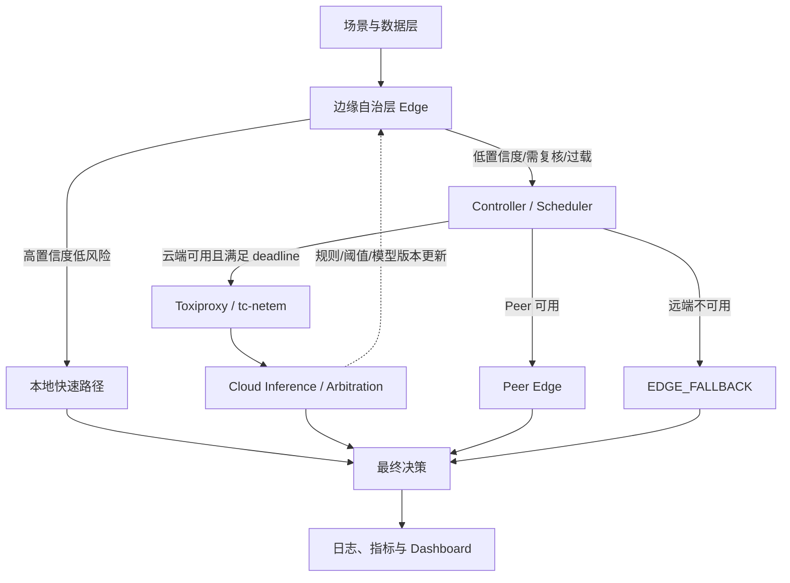
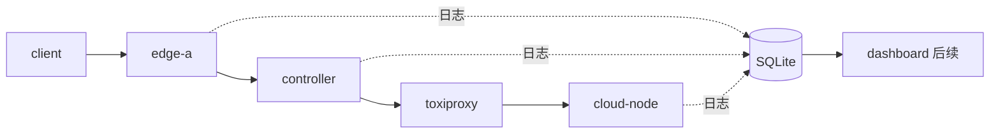

# XH-202606 云边协同系统架构与技术栈设计方案

> 版本：v1.1  
> 日期：2026-07-10  
> 状态：架构定稿 / MVP v0.1 已实现

## 一句话结论

采用 **“边缘自治 + 中央协同调度 + 云端增强”** 的分层架构：传感器或客户端先将任务交给边缘节点；边缘端独立完成高置信度、低风险和紧急安全任务；只有低置信度、需要复核或本地过载的任务才请求中央调度器。调度器再依据网络、节点负载、任务风险和截止时间选择云端、其他边缘节点或本地降级路径。

## 1. 设计目标

1. 建立能够解释“为什么在边缘、为什么上云、为什么降级”的 Demo。
2. 云端或调度器不可用时，边缘端仍能维持基本业务。
3. 调度器综合 confidence、网络、负载、risk 和 deadline 选择路径。
4. 所有决策可通过结构化日志复现。
5. 通过 Adapter 在不修改调度器的情况下支持两个场景。

## 2. 总体架构



### 核心原则

- Client/Sensor 的首跳是 Edge，而不是 Controller。
- Controller 是协同控制平面，不是所有请求的必经数据平面。
- Edge 不自行递归转发；Peer Edge 由 Controller 统一选择。
- 第一阶段采用可解释规则调度，不引入强化学习。
- 模型、云端供应方和场景均通过 Adapter 解耦。
- 日志和指标从第一版开始建设。

## 3. 模块划分

### Edge Node

- Preprocessor：数据校验和输入构造。
- Model Adapter：Mock、XGBoost、ONNX、量化小模型统一接口。
- Confidence & Risk：输出 prediction、confidence、risk、latency。
- Local Policy：本地快速路径、紧急安全动作、EDGE_FALLBACK。
- Resource Agent：CPU、内存、队列、模型版本和健康状态。
- Local Store：断网缓存和待同步记录。

### Controller / Scheduler

输入：edge_result、risk、deadline、network_state、node_state、cloud_state。  
输出：EDGE、CLOUD、PEER_EDGE、EDGE_FALLBACK，以及 decision_reason。

### Cloud

- 复杂任务推理；
- 多节点信息融合；
- 冲突仲裁；
- 阈值、规则和模型版本下发。

### Metrics & Dashboard

记录 task、inference、decision 和 node heartbeat；展示路径、时延、准确率、上云比例、通信量和弱网完成率。

## 4. 调度规则

```python
if task.risk == "critical":
    execute_local_safety_action()
    request_cloud_review_async_if_available()
    route = "EDGE_SAFETY"
elif edge_result.confidence >= local_threshold:
    route = "EDGE"
elif cloud_available:
    route = "CLOUD"
else:
    route = "EDGE_FALLBACK"
```

完整版本再加入：云端预计完成时间是否小于 deadline、Peer Edge 是否空闲、hop_count 是否为 0。

动态阈值方向：网络越差，本地阈值应降低，使更多非高风险任务留在本地。

```text
T_dynamic = clip(T_base - alpha * network_degradation, T_min, T_max)
```

后续可使用代价函数：

```text
J(route) = w1*预计时延 + w2*错误风险 + w3*通信成本 + w4*节点负载
```

## 5. 多边缘节点

- 采用中央 Node Registry 和心跳，不使用自由广播发现。
- 所有 Peer 转发由 Controller 发起。
- hop_count 最大为 1；visited_nodes 防重复。
- task_id 用于幂等；每个任务有固定 deadline。
- 仲裁顺序：高风险优先 → 高置信度优先 → 云端裁决 → 保守策略。

## 6. 技术栈

| 层次 | 推荐技术 |
|---|---|
| 服务端 | Python 3.12 + FastAPI + Pydantic |
| 通信 | HTTP/JSON + httpx |
| 编排 | Docker Compose |
| 边缘推理 | Mock → XGBoost/ONNX Runtime |
| 边缘文本模型 | 可选 llama.cpp + 量化国产开源小模型 |
| 云端 | OpenAI-compatible Adapter / 本地模型服务 |
| 弱网模拟 | Toxiproxy；Linux 后期 tc/netem |
| 存储 | SQLite + SQLModel/SQLAlchemy |
| 监控 | psutil + JSON logging |
| 前端 | React + TypeScript + Vite |
| 可视化 | ECharts + React Flow |
| 测试 | pytest + httpx；后期 Locust |
| CI | GitHub Actions |

## 7. 第一阶段本地部署



第一阶段只需启动 client、edge-a、controller、toxiproxy、cloud-node。Dashboard 后置。

## 8. 第一轮验收案例

1. confidence=0.95，普通风险 → EDGE，不调用云端。
2. confidence=0.55，云端正常 → CLOUD。
3. confidence=0.55，云端断开 → EDGE_FALLBACK，有限时间返回。
4. risk=critical → EDGE_SAFETY，本地动作不受云端阻塞。

## 9. 推荐 API

- Edge：`POST /v1/infer`、`GET /health`、`GET /metrics`
- Controller：`POST /v1/escalate`、`POST /v1/nodes/heartbeat`
- Cloud：`POST /v1/infer`、`POST /v1/arbitrate`、`GET /v1/health`
- Dashboard：`GET /v1/events`（SSE）

## 10. 实验策略

基线：Cloud Only、Edge Only、Confidence Cascade、Network-aware、Full Adaptive。  
网络：20ms、100ms、300ms、5%-10% 丢包、短时断网、云端故障。  
指标：Accuracy/Recall/F1、平均/P95/TTFT、上云比例、上传字节、峰值内存、任务完成率、冲突率和冲突解决成功率。

## 11. 本周交付

- 系统总体架构与数据流；
- 模块职责和通信关系；
- Docker Compose 本地模拟方案；
- API 与数据结构草案；
- 第一阶段四个端到端案例；
- 技术栈与关键决策说明。

## 12. 推荐仓库结构

```text
cloud-edge-decision/
├── docs/
├── services/{edge_node,controller,cloud_node,data_generator,dashboard}/
├── models/{adapters,artifacts}/
├── datasets/{industrial,traffic}/
├── experiments/{configs,scripts,results}/
├── infra/{docker-compose.yml,toxiproxy}/
├── tests/{unit,integration,scenarios}/
└── data/metrics.db
```

## 参考依据

《面向云边协同场景的分布式人工智能感知与决策关键技术研究》比赛方案，题目编号 XH-202606，山东浪潮数据库技术有限公司。


## 13. MVP v0.1 实现与仓库交付状态

已完成单边缘节点 MVP，并初始化独立 Git 仓库。首个提交：`236bdb9`。

### 已实现

- Edge Node：本地推理、confidence 路由、高风险安全动作；
- Controller：云端调用、timeout/deadline、保守降级；
- Cloud Node：模拟增强推理，可替换为真实模型 Adapter；
- Recorder：SQLite 事件日志；
- Dashboard：路由统计和最近决策；
- Toxiproxy：Docker Compose 中的云端链路故障注入；
- 测试：7 个单元测试通过，真实多进程集成测试四条路径通过。

### 四条已验证路径

1. 高 confidence、低风险 → `EDGE`；
2. 低 confidence、云端可用 → `CLOUD`；
3. 低 confidence、云端不可用 → `EDGE_FALLBACK`；
4. critical 风险 → `EDGE_SAFETY`。

### 仓库规范

仓库已包含 `README.md`、`docs/ROADMAP.md`、架构/实现/API/测试/周报文档、ADR、GitHub Actions、Issue/PR 模板和 Docker Compose。当前执行环境未安装 Docker，因此容器级启动和 Toxiproxy 需要在团队本机完成最终验证。

### 启动

```bash
cp .env.example .env
docker compose up --build -d
python scripts/smoke_test.py
```

Dashboard：`http://localhost:8080`。

### GitHub

本地 Git 仓库已经初始化。当前 GitHub 连接器不提供新建仓库接口，交付包中包含 `.git` 历史和 `docs/PUSH_TO_GITHUB.md`，创建空私有仓库后可直接推送。
